# Analysis of Recent Deep-Learning-Based Intrusion Detection Methods for In-Vehicle Network

基于深度学习的车载网络入侵检测方法分析

原文链接：[Analysis of Recent Deep-Learning-Based Intrusion Detection Methods for In-Vehicle Network | IEEE Journals &amp; Magazine | IEEE Xplore](https://ieeexplore.ieee.org/document/9963783)

工程技术TOP；EI检索；SCI升级版；工程技术1区；SCI基础版；工程技术2区；IF 7.9；SWJTU A++；CCF B

## 摘要

车联网通信的发展和普及，给车载网络安全带来了更多风险。因此，越来越多的各种有效的入侵检测方法似乎可以保证车载网络的安全，尤其是基于深度学习的方法。然而，最先进的基于深度学习的入侵检测方法缺乏定量和公平的水平性能比较分析。此外，他们没有对未知攻击的检测能力以及智能入侵检测模型的时间和硬件资源消耗进行比较分析。因此，本文研究了 10 种具有代表性的基于深度学习的先进入侵检测方法，并说明了每种方法的特点和优势。此外，还设置了定量和公平的实验来进行水平比较分析。此外，本研究为基线方法选择提供了一些重要的建议和有价值的指导，为未来轻量级模型和未知攻击检测能力的研究方向提供了有价值的指导。

## 文章主要贡献

* 选择最具代表性和先进性、具有比较性能优势的方法作为每类算法的代表，进行横向对比实验，得到更公平的检测效果对比结果。因此，可以为未来的研究提供基线选择建议。
* 研究和评估了 10 种代表性算法的推理延迟和内存消耗，以使其适应 IVN 有限的嵌入式资源环境。并且，对模型的适应性进行了全面分析。
* 评估了这 10 个模型对未知攻击的检测能力，发现现有算法对未知攻击的检测能力较弱，甚至没有考虑未知攻击。根据这一点，提出了车载网络中入侵检测技术的未来发展方向。

## 十种典型入侵检测方法

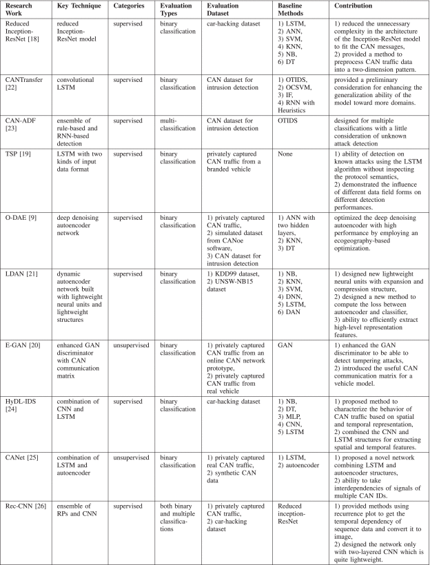

## 定量实验

**数据集：**the CAN dataset for intrusion detection；the car-hacking dataset（第一个数据集存在数据标签丢失，文中使用第二个数据集实验，黑客数据集内容如下图，包含普通的CAN报文和四种典型攻击：DoS攻击、模糊攻击、欺骗驱动攻击和欺骗RPM攻击。文中使用DoS、模糊和冒充攻击对模型进行评估，DoS攻击用作训练模型，模糊和冒充攻击用作测试）

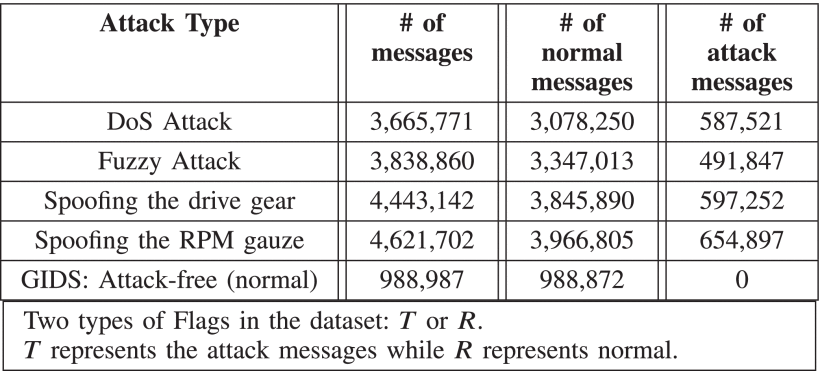

使用3折交叉验证策略寻找每个模型的最佳epoch，验证曲线中损失最低的点记为该模型的最佳epoch，平均损失曲线如下图。使用70%的正常和DoS攻击数据集中数据作为训练集，剩下30%每次测试随机取5%作为测试集使用。数据预处理使用每个模型的原始预处理方法，如下图所示。

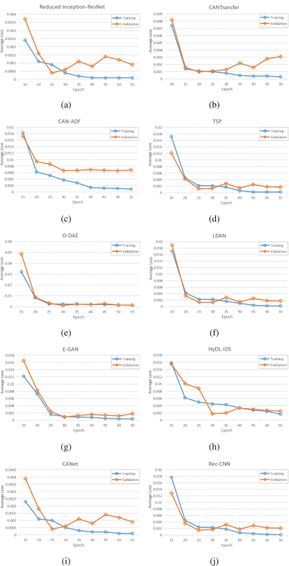

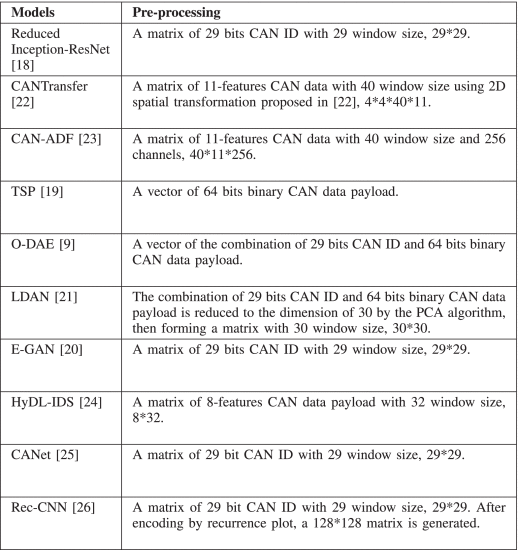

**评价指标：**从运行性能和检测性能两方面进行评价。运行性能包括时间消耗和硬件资源消耗，时间消耗指每个epoch消耗的时间，硬件资源消耗指使用的内存资源；检测性能包括准确率、精度、召回率、假阳率、假阴率和F1值。

## 结果分析

包含对运行性能和对检测性能的结果分析。

运行性能包括平均训练时间、平均预测时间以及推理过程内存消耗，由图可知后三种方法加上LDAN有较好的运行性能；

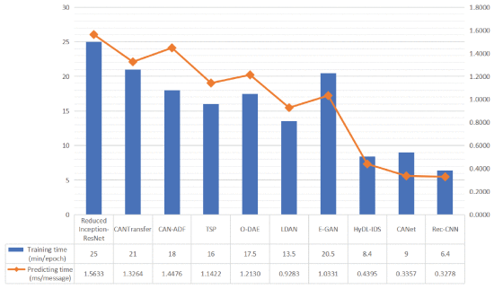	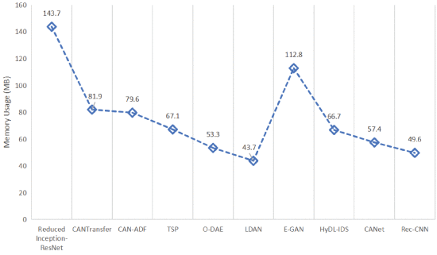

检测性能评估包括对检测未知攻击的能力和检测对已知DoS攻击的比较。下面第一张图为检测未知攻击的评估指数，可以看出有些模几乎不具备检测未知攻击的能力。第二张图表示使用DoS攻击对所有模型进行横向比较，表明所有模型都可以正确区分正常和DoS攻击的消息。第三张图展示了所有模型对DoS攻击的评价指标。第四张图使用ROC曲线展示了所有模型在处理不平衡数据集中有较好的性能。

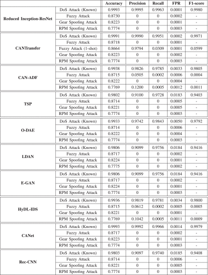	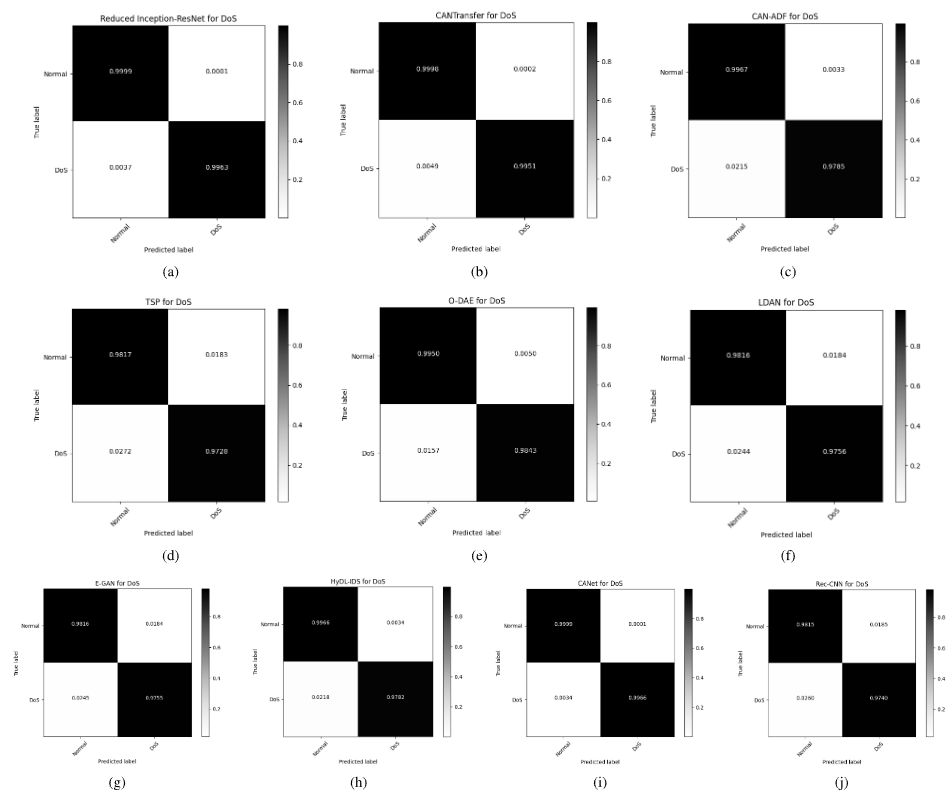	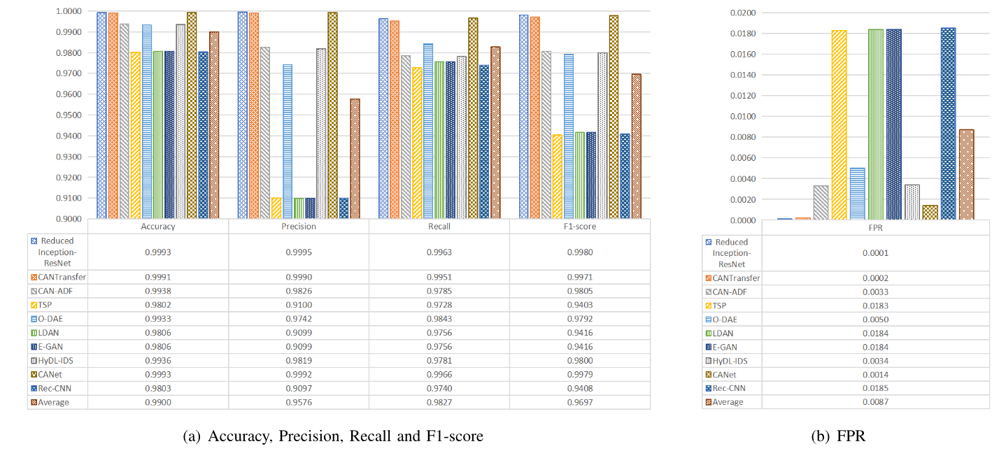		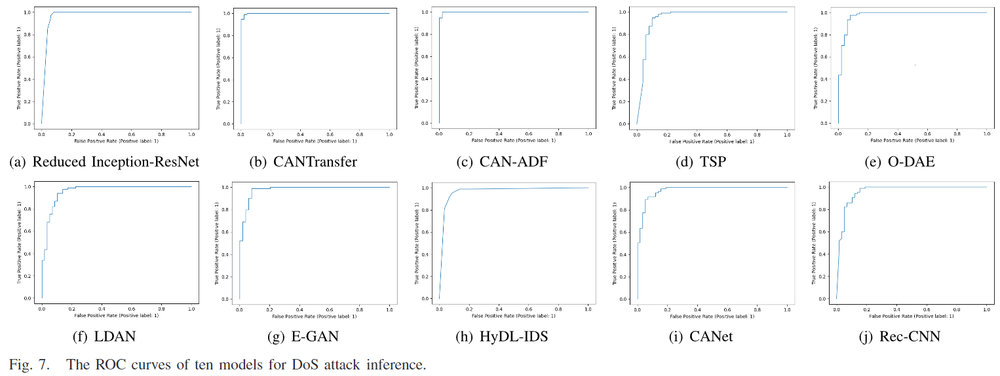

## 未来工作

未来在基于深度学习的车载入侵检测技术领域，建议增强模型对未知攻击的检测能力、运行速度以及减少资源消耗。此外，建议在入侵检测模型中设计基于时间和空间的浅层特征提取架构，并使用迁移学习来提高模型的泛化能力。

# In-vehicle network intrusion detection using deep convolutional neural network

基于深度卷积神经网络的车载网络入侵检测

原文链接：[In-vehicle network intrusion detection using deep convolutional neural network - ScienceDirect](https://www.sciencedirect.com/science/article/pii/S2214209619302451?via%3Dihub)

**SCI升级版 计算机科学2区；SCI基础版 工程技术2区；IF 5.8**

## 摘要

在现代汽车中实施电子设备导致针对车载网络的攻击增加;因此，攻击检测模型引起了汽车行业及其研究人员的注意。车辆网络安全是一个紧迫而重要的问题，因为车辆的故障会直接影响人类和道路安全。控制器局域网 （CAN） 用作车载网络的事实标准，它没有足够的安全功能，例如消息加密和发件人身份验证，以保护网络免受网络攻击。在本文中，我们提出了一种基于深度卷积神经网络 （DCNN） 的入侵检测系统 （IDS） 来保护车辆的 CAN 总线。DCNN 学习网络流量模式并检测恶意流量，而无需手动设计功能。我们设计了 DCNN 模型，该模型针对 CAN 总线的数据流量进行了优化，以实现高检测性能，同时减少 Inception-ResNet 模型架构中不必要的复杂性。我们使用真实车辆构建的数据集进行了一项实验研究，以评估我们的检测系统。实验结果表明，与传统的机器学习算法相比，所提出的 IDS 具有显着较低的假阴性率和错误率。

## 文章主要贡献

* 首先，据我们所知，这项工作是将 DCNN 应用于 IDS 以实现车载网络安全的第一项研究。我们采用了一种名为 Inception-ResNet 的最新DCNN架构，它展示了自然图像分类任务中最先进的性能。此外，我们还评估了该网络在车载网络中进行入侵检测的有效性。
* 其次，我们通过注入和记录 CAN 消息，使用真实车辆构建了完全标记的车载网络攻击数据集。我们的数据集是公开的，以促进进一步的研究。
* 第三，从使用我们构建的真实数据集的大量实验中，我们证明，与传统的机器学习算法相比，我们的检测模型显示出更高的检测性能。此外，所提出的数据预处理方法成功地用于车内入侵检测。

## 使用Inception-ResNet的入侵检测系统

训练和检测流程如下图所示：

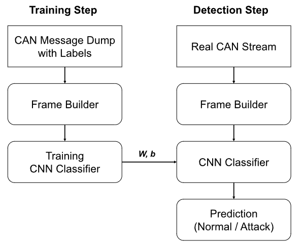

**帧生成器：**接收最近29个CAN报文，提取其中的CANID，构成一个29x29的矩阵，每个元素均为1或0，一行代表一个标识符，一个帧由29个标识符组成，将每个帧标识为1攻击，0正常，用于监督学习，如下图所示。

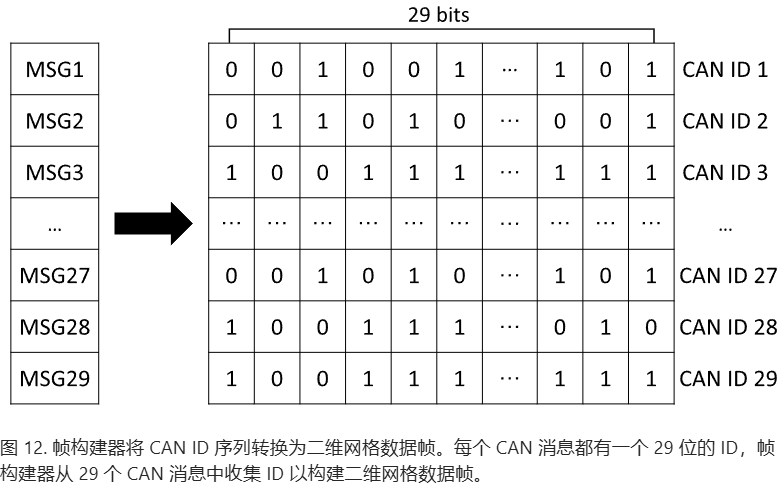

简化后的Inception-ResNet网络：输入维度29x29x1，输出2。整体流程图如下。使用平均池化和Dropout正则化，使用交叉熵计算损失函数。

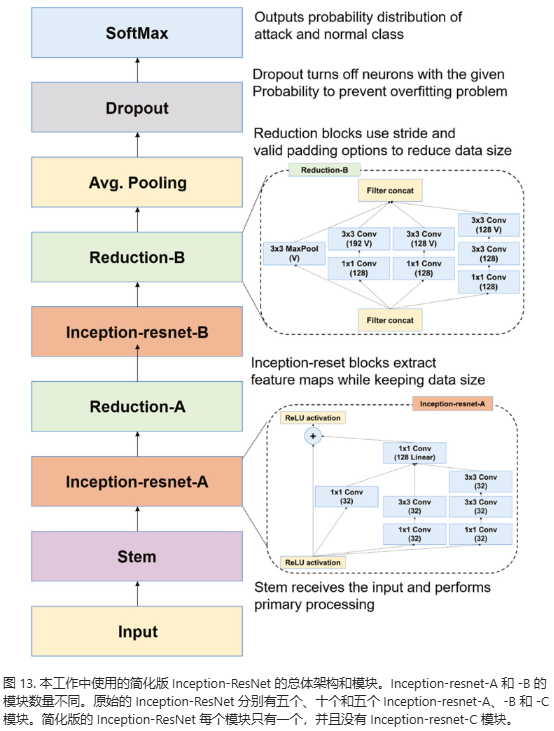	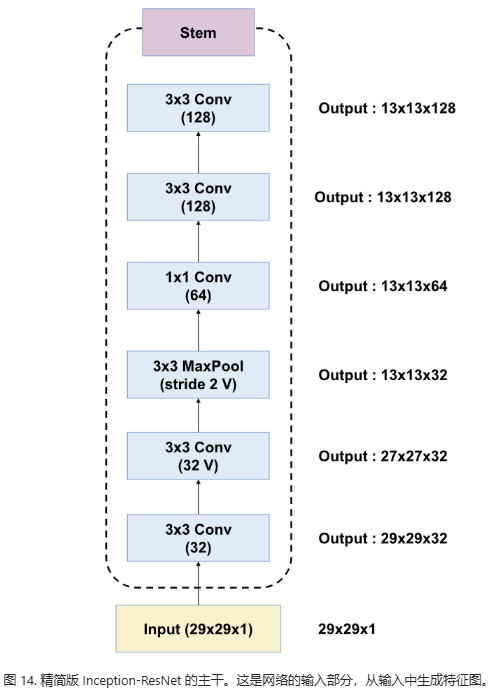	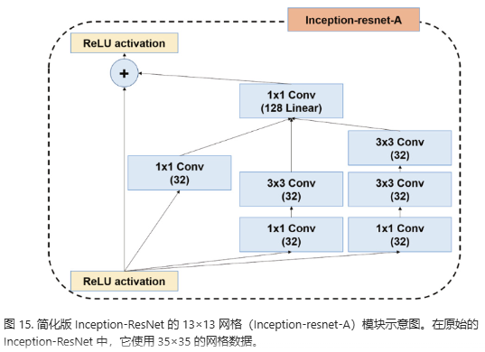	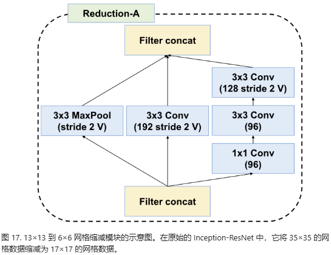	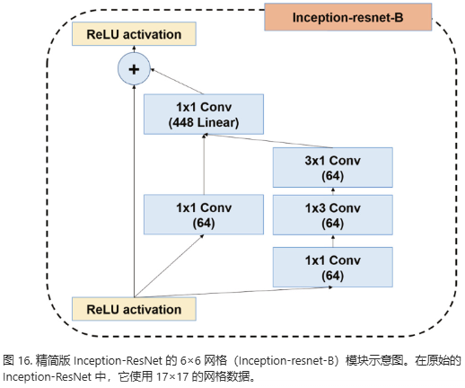	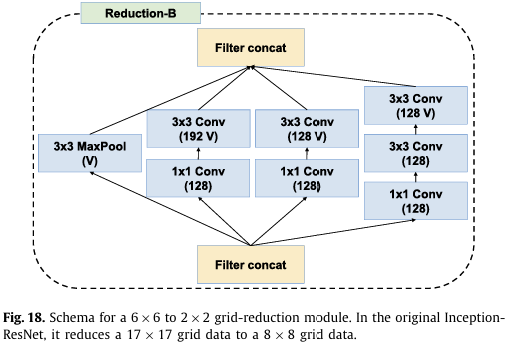

## 结果分析

每0.3毫秒注入一个CANID全0的报文作为DoS攻击，每0.5毫秒注入一个随机报文作为模糊攻击，每1毫秒注入某个CAN报文执行欺骗驱动齿轮和欺骗RPM攻击。下图展示各种攻击的训练损失，可以看出攻击复杂度增加，模型收敛速度变慢。

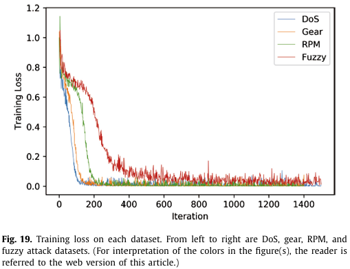

使用假阴率、错误率、精度、召回率和F1值作为评价指标。使用0.001作为学习率。如下图所示，在DoS和欺骗攻击中表现良好，但在模糊攻击中表现不稳定。第二张图展示详细的测试结果。第三张图是针对各种攻击的预测混淆矩阵。第四张图展示了本文方法与其他方法在针对各类攻击中的表现。

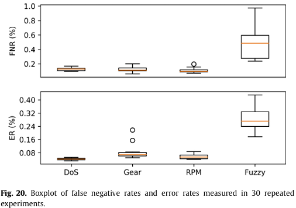	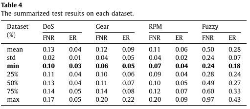	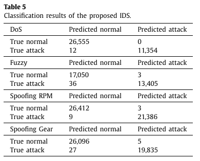

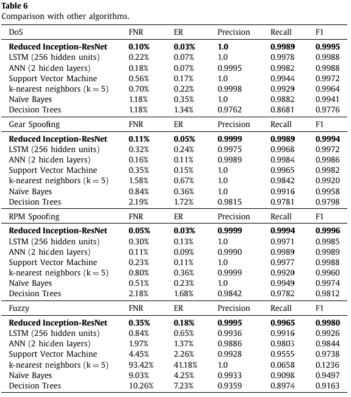

第一张图展示了在DCNN模型上训练和测试所用时间，第二张图展示了在LSTM模型上训练和测试所用的时间。得出在实践中，最好设置较小的批处理大小，因为大批处理需要更长的时间来收集消息，并且可能会延迟入侵检测。

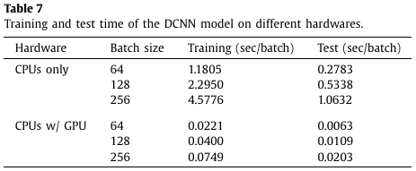	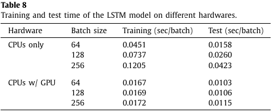

## 未来工作

该模型在检测未学习的攻击类型方面存在根本性限制，因为它基于监督学习。为了解决这个问题，需要使用高级学习技术（例如对抗性训练）对未知攻击检测进行额外的研究。除了检测从外部注入的消息外，还必须利用语义特征来检测由于车辆故障而导致的错误数据传输，这需要车辆供应商的合作。

# CANTransfer: **transfer learning based intrusion detection on a controller area network using convolutional LSTM network**

CANTransfer：使用卷积LSTM网络在控制器局域网上进行基于迁移学习的入侵检测

原文链接：[CANTransfer | Proceedings of the 35th Annual ACM Symposium on Applied Computing](https://dl.acm.org/doi/10.1145/3341105.3373868)

## 摘要

车载通信中，由于简单性和可靠性，控制器局域网络（CAN）总线被广泛用作事实上的标准，以在电子控制单元（ECU）之间提供串行通信。然而，先前的研究表明，在 CAN 总线中可以轻松执行和利用几种网络级攻击。此外，新型入侵攻击被频繁发现。但是，除非我们有大量关于入侵的数据，否则开发一种高效的基于深度神经网络的检测机制并不容易。为了应对这一挑战，我们提出了 CANTransfer，一种使用迁移学习的 CAN 总线入侵检测方法，其中基于卷积长短期记忆的模型使用已知入侵进行训练，以检测新的攻击。通过应用一次性学习，该模型可以适应使用有限数量的新数据集检测新的入侵。我们进行了广泛的实验，并在检测新入侵方面比最佳基线模型实现了 26.60% 的性能提升。

## 文章主要贡献

* 新型攻击检测架构：开发了 CANTransfer，这是一种基于基于 ConvLSTM 模型的新型入侵检测架构，能够检测多元时间序列数据中的攻击。CANTransfer 不仅可以检测 CAN 总线中的已知攻击，还能够通过迁移学习检测未知攻击。
* 使用真实数据集进行评估：我们使用从两辆真实车辆（起亚秀尔 [34] 和现代索纳塔 [33]）收集的 CAN 数据集评估了我们方法的准确性。我们还将我们的模型与其他四个基线模型进行了比较，并证明对于已知攻击（95.25% 对 83.3%）和新攻击（88.47% 对 58.78%），我们都比最佳基线方法实现了更高的检测性能。
* 一次性学习的有效性：特别是，我们通过各种实验证明了在检测不同攻击变体时一次性学习的高准确性，其中我们的模型仅需一个新入侵样本的样本量即可检测到一种新的入侵类型。

## 基于ConvLSTM的CANTransfer

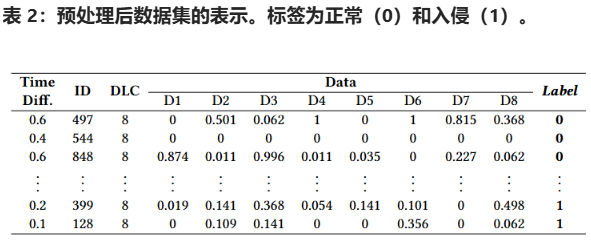

进行时间序列变换，构造一个多变量时间序列

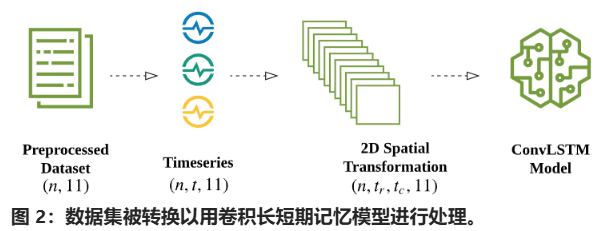

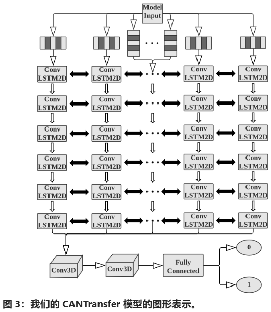	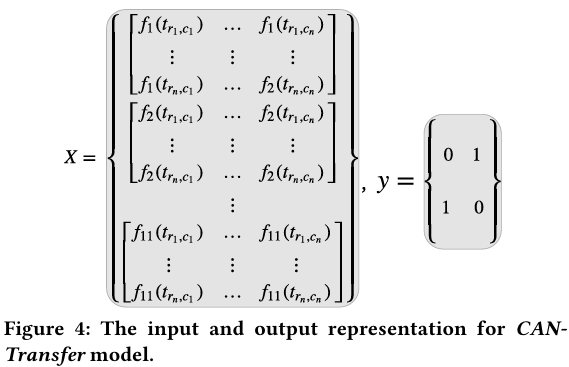

## 结果分析

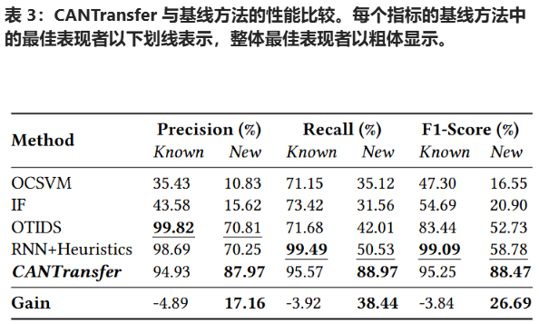	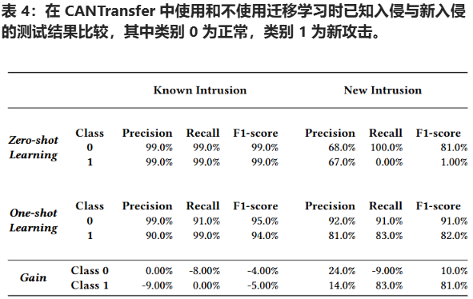

使用ConvLSTM+迁移学习在识别未知攻击时具有较好的表现。
