# Threat Analysis for Automotive CAN Networks A GAN Model-Based Intrusion Detection Technique

汽车 CAN 网络的威胁分析：一种基于生成对抗网络模型的入侵检测技术

原文链接：[Threat Analysis for Automotive CAN Networks: A GAN Model-Based Intrusion Detection Technique | IEEE Journals &amp; Magazine | IEEE Xplore](https://ieeexplore.ieee.org/document/9352238)

CCF-B

## 摘要

随着车联网、网联汽车、自动驾驶汽车和自动驾驶技术的快速发展，汽车控制器局域网络（CAN）面临着众多安全威胁。深度学习模型是当前用于威胁分析的主流入侵检测技术，最先进的入侵检测技术引入了生成对抗网络（GAN）模型来生成可用的攻击样本以补充训练样本，但它存在 CAN 报文块构建粗糙的局限性，并且无法检测数据篡改威胁。基于汽车原始设备制造商（OEM）为某一车型定义的 CAN 通信矩阵，我们提出了一种具有精细 CAN 报文块和增强型 GAN 判别器的增强型深度学习 GAN 模型。训练样本中的精细 CAN 报文块可以准确反映检测阶段真实生成的 CAN 报文块。**GAN 判别器可以检测每条报文是否遭受了数据篡改威胁。**实验结果表明，在各种攻击和威胁下，增强型深度学习 GAN 模型比最先进的深度学习 GAN 模型具有更高的检测准确率、召回率和 F1 分数。

## 本文贡献

* 根据 CAN 通信矩阵中提供的消息发送类型，让 CAN 消息块中的所有 CAN 消息任务都来自同一个 CAN 消息（即所有 CAN 消息任务具有相同的消息标识符）。通过这种处理，训练样本中精心设计的 CAN 消息块可以准确地反映检测阶段实际生成的 CAN 消息块。
* 由于 CAN 通信矩阵提供了消息中每个信号的最小值和最大值所需的范围（一条消息包含多个信号），将 CAN 通信矩阵添加到 GAN 判别器中以训练增强型 GAN 判别器。通过增强型 GAN 判别器，我们可以判别每条消息是否遭受了数据篡改威胁，从而提高入侵检测精度。
* 实验结果表明，在各种威胁和攻击下，增强型深度学习生成对抗网络模型比最先进的深度学习生成对抗网络模型具有更高的检测精度和召回率。

## 预处理

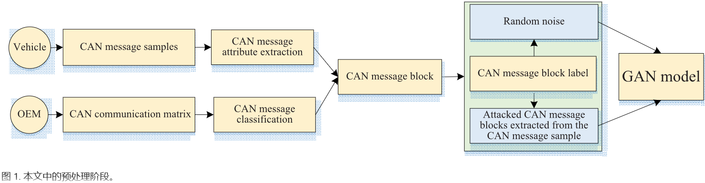

**A. CAN 通信矩阵和消息分类**

使用汽车原始制造商提供的数据库CAN文件形成了一个CAN通信矩阵，矩阵划分消息类型为正常通信消息、网络管理消息和诊断消息；划分消息发送类型有周期性的、事件触发的、如果激活的、周期性和事件触发的以及周期性和如果激活的，并且为每种消息分类定义了具体的ID范围如下图。五种消息类型的示例图如下。

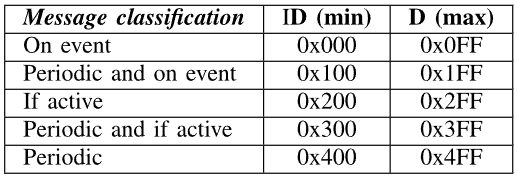

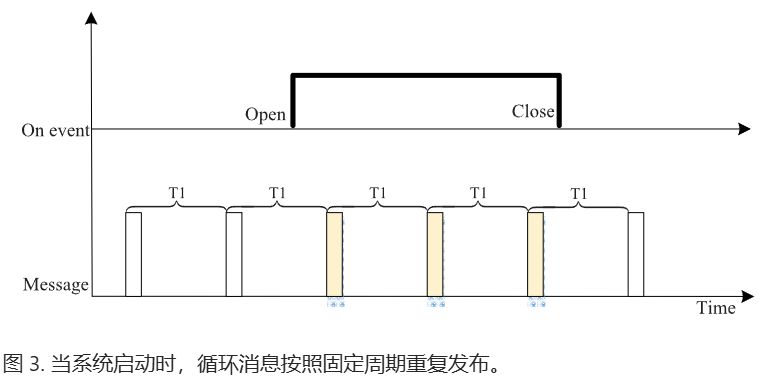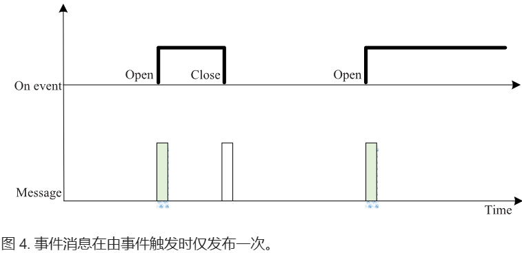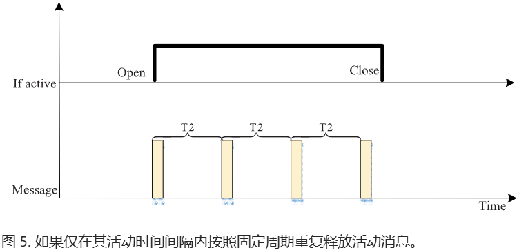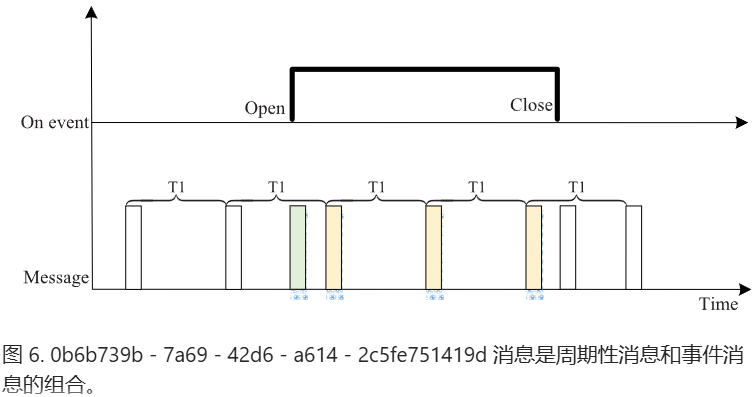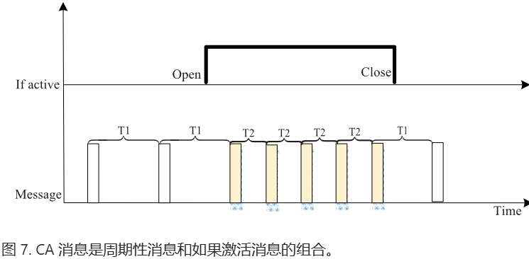

**B. CAN 报文示例和属性提取**

本文报文提取了时间戳、ID、消息长度三个特征。

**C. CAN 报文块**

本文报文块由64个报文信息构成，并且所有报文信息都具有相同的报文ID

**D. 消息标签**

根据消息是否受到攻击并结合消息分类建立了 10 种类型的标签，如下图所示。

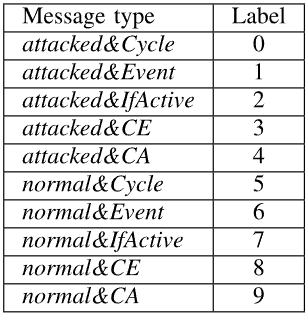

## 深度学习生成对抗网络模型

**A. GAN 模型组织**

GAN模型基本原理图如下，其中G生成器（用于输出合成的受攻击的CAN消息块）和D判别器（用于判断CAN消息快是否受到攻击）是模型中的核心组件。

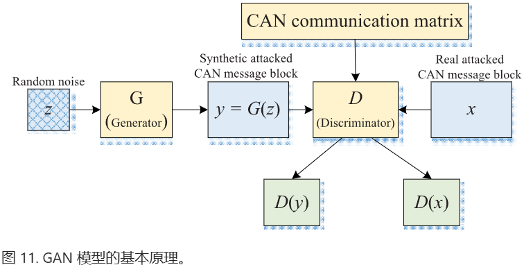

**B. 增强型生成对抗网络判别器**

在上述GAN模型中添加了CAN消息矩阵，旨在检测数据篡改攻击。

**C. 生成器训练与损失函数设计**

由于实际攻击的样本远小于正常样本，需要对生成器进行训练以获得更多的合成攻击样本，下图为生成器的训练过程。

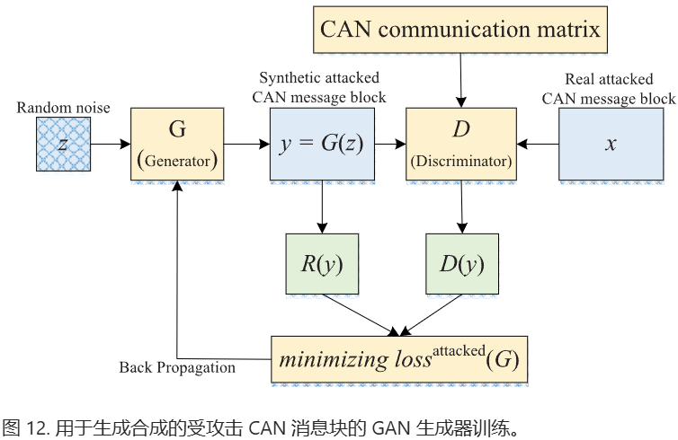

**D. 判别器训练和损失函数设计**

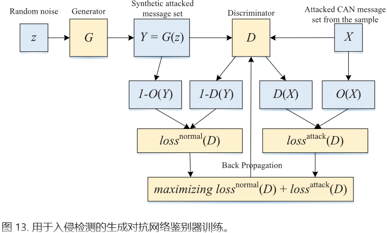

**E. 使用生成对抗网络判别器进行入侵检测**

GAN 生成器的目标是尽可能生成真实的CAN消息块以欺骗 GAN 判别器，而 GAN 判别器的目标是尝试区分 GAN 生成器生成的 CAN 消息块与从 CAN 消息样本中收集的真实受攻击的 CAN 消息块。这样，GAN 生成器和 GAN 判别器构成了一个动态的 “博弈过程”。最终，通过 GAN 生成器和 GAN 判别器的相互博弈学习产生良好的输出。

## 实验

**A. 实验过程和指标**

评价指标有精度、召回率和F1值。

**B. 检测结果与分析**

G-GAN 和 D-GAN 分别代表训练生成对抗网络（GAN）生成器和判别器的入侵检测技术。E-GAN 代表本文开发的入侵检测技术。

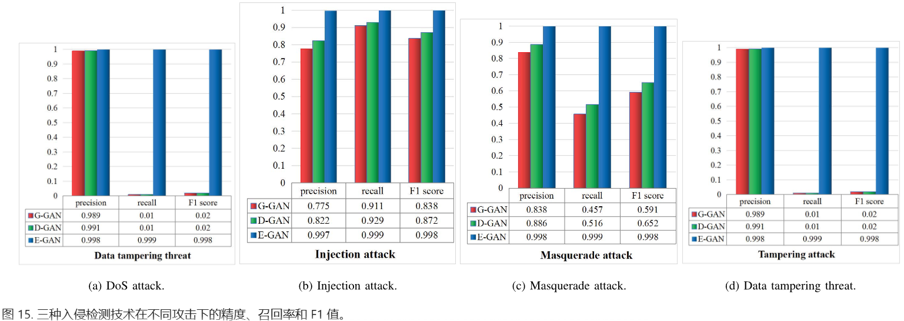
