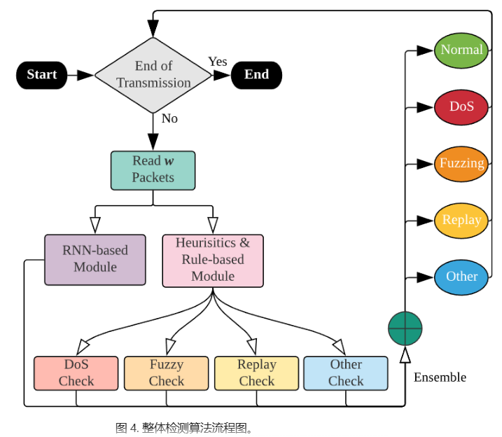
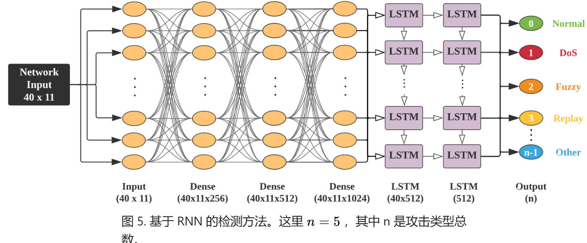
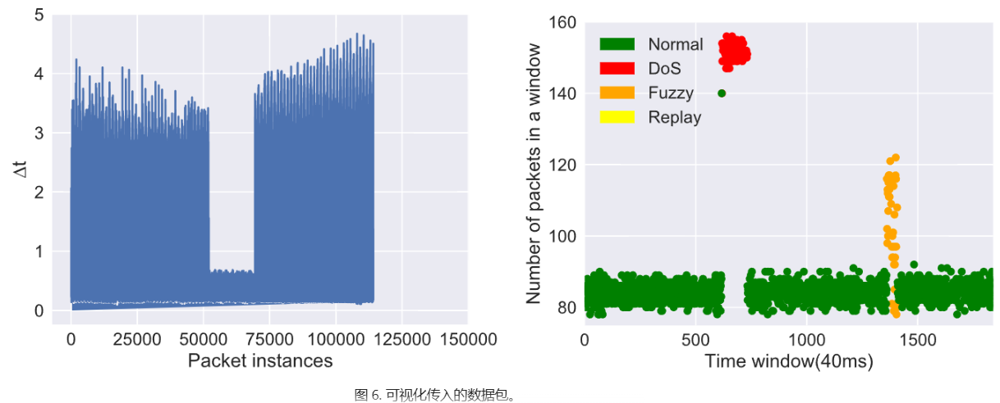
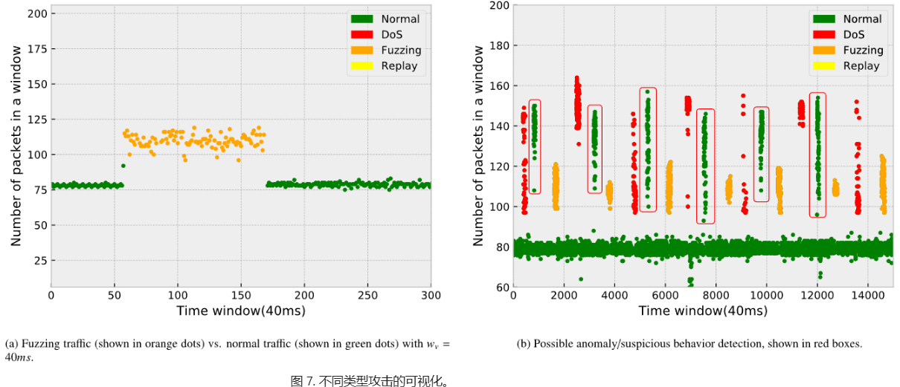
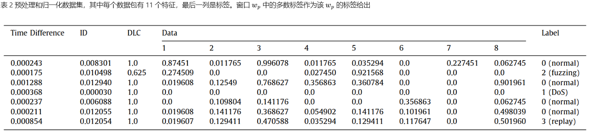
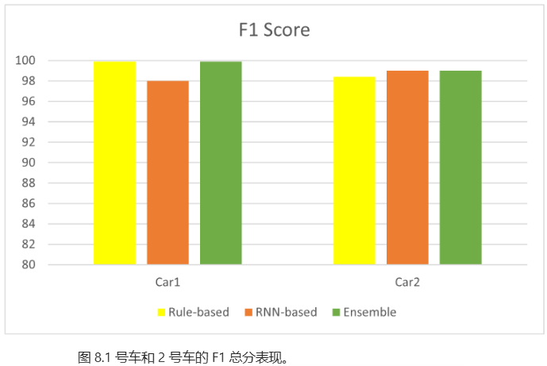
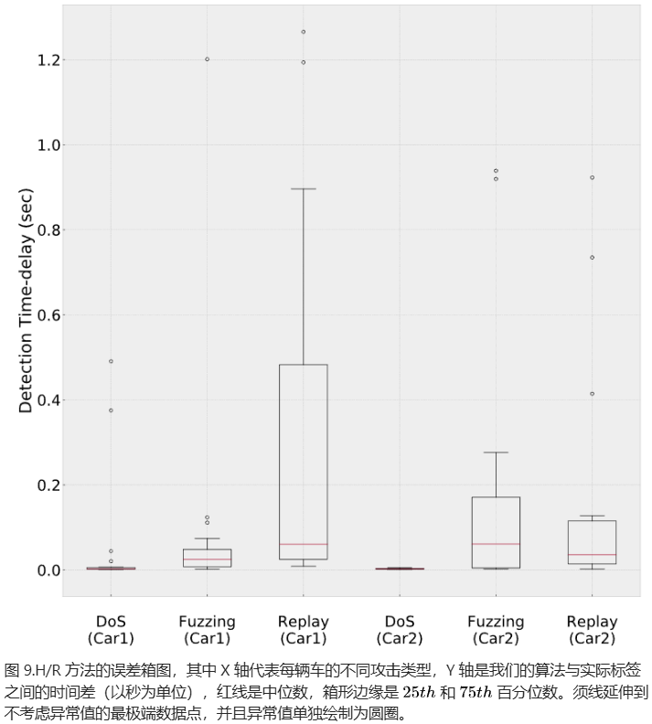
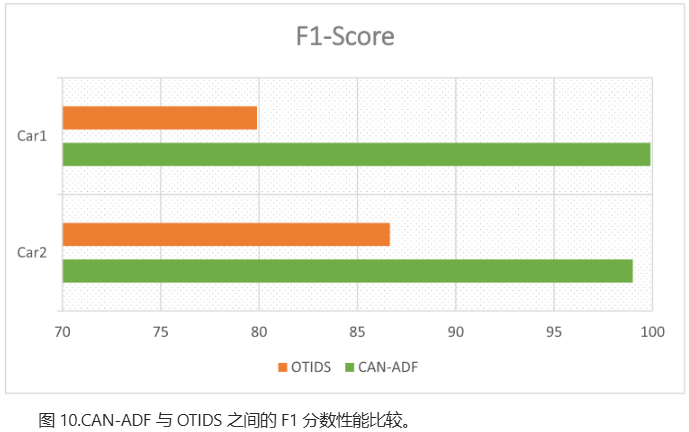

# Threat Analysis for Automotive CAN Networks A GAN Model-Based Intrusion Detection Technique

汽车 CAN 网络的威胁分析：一种基于生成对抗网络模型的入侵检测技术

原文链接：[Threat Analysis for Automotive CAN Networks: A GAN Model-Based Intrusion Detection Technique | IEEE Journals &amp; Magazine | IEEE Xplore](https://ieeexplore.ieee.org/document/9352238)

CCF-B

## 摘要

随着车联网、网联汽车、自动驾驶汽车和自动驾驶技术的快速发展，汽车控制器局域网络（CAN）面临着众多安全威胁。深度学习模型是当前用于威胁分析的主流入侵检测技术，最先进的入侵检测技术引入了生成对抗网络（GAN）模型来生成可用的攻击样本以补充训练样本，但它存在 CAN 报文块构建粗糙的局限性，并且无法检测数据篡改威胁。基于汽车原始设备制造商（OEM）为某一车型定义的 CAN 通信矩阵，我们提出了一种具有精细 CAN 报文块和增强型 GAN 判别器的增强型深度学习 GAN 模型。训练样本中的精细 CAN 报文块可以准确反映检测阶段真实生成的 CAN 报文块。**GAN 判别器可以检测每条报文是否遭受了数据篡改威胁。**实验结果表明，在各种攻击和威胁下，增强型深度学习 GAN 模型比最先进的深度学习 GAN 模型具有更高的检测准确率、召回率和 F1 分数。

## 本文贡献

* 根据 CAN 通信矩阵中提供的消息发送类型，让 CAN 消息块中的所有 CAN 消息任务都来自同一个 CAN 消息（即所有 CAN 消息任务具有相同的消息标识符）。通过这种处理，训练样本中精心设计的 CAN 消息块可以准确地反映检测阶段实际生成的 CAN 消息块。
* 由于 CAN 通信矩阵提供了消息中每个信号的最小值和最大值所需的范围（一条消息包含多个信号），将 CAN 通信矩阵添加到 GAN 判别器中以训练增强型 GAN 判别器。通过增强型 GAN 判别器，我们可以判别每条消息是否遭受了数据篡改威胁，从而提高入侵检测精度。
* 实验结果表明，在各种威胁和攻击下，增强型深度学习生成对抗网络模型比最先进的深度学习生成对抗网络模型具有更高的检测精度和召回率。

## 预处理

**A. CAN 通信矩阵和消息分类**

使用汽车原始制造商提供的数据库CAN文件形成了一个CAN通信矩阵，矩阵划分消息类型为正常通信消息、网络管理消息和诊断消息；划分消息发送类型有周期性的、事件触发的、如果激活的、周期性和事件触发的以及周期性和如果激活的，并且为每种消息分类定义了具体的ID范围如下图。五种消息类型的示例图如下。

**B. CAN 报文示例和属性提取**

本文报文提取了时间戳、ID、消息长度三个特征。

**C. CAN 报文块**

本文报文块由64个报文信息构成，并且所有报文信息都具有相同的报文ID

**D. 消息标签**

根据消息是否受到攻击并结合消息分类建立了 10 种类型的标签，如下图所示。

## 深度学习生成对抗网络模型

**A. GAN 模型组织**

GAN模型基本原理图如下，其中G生成器（用于输出合成的受攻击的CAN消息块）和D判别器（用于判断CAN消息快是否受到攻击）是模型中的核心组件。

**B. 增强型生成对抗网络判别器**

在上述GAN模型中添加了CAN消息矩阵，旨在检测数据篡改攻击。

**C. 生成器训练与损失函数设计**

由于实际攻击的样本远小于正常样本，需要对生成器进行训练以获得更多的合成攻击样本，下图为生成器的训练过程。

**D. 判别器训练和损失函数设计**

**E. 使用生成对抗网络判别器进行入侵检测**

GAN 生成器的目标是尽可能生成真实的CAN消息块以欺骗 GAN 判别器，而 GAN 判别器的目标是尝试区分 GAN 生成器生成的 CAN 消息块与从 CAN 消息样本中收集的真实受攻击的 CAN 消息块。这样，GAN 生成器和 GAN 判别器构成了一个动态的 “博弈过程”。最终，通过 GAN 生成器和 GAN 判别器的相互博弈学习产生良好的输出。

## 实验

**A. 实验过程和指标**

评价指标有精度、召回率和F1值。

**B. 检测结果与分析**

G-GAN 和 D-GAN 分别代表训练生成对抗网络（GAN）生成器和判别器的入侵检测技术。E-GAN 代表本文开发的入侵检测技术。

# CAN-ADF: The controller area network attack detection framework

CAN-ADF：控制器局域网络攻击检测框架

原文链接：[CAN-ADF: The controller area network attack detection framework - ScienceDirect](https://www.sciencedirect.com/science/article/pii/S0167404820301292)

2020 CCF-B

## 摘要

近年来，人们对开发自动驾驶汽车等自动驾驶车辆产生了极大的兴趣。在车载通信中，由于简单性和可靠性，控制器局域网络（CAN）总线被广泛用作事实上的标准，以在电子控制单元（ECU）之间提供串行通信。然而，先前的研究表明，由于 CAN 总线缺乏防御机制，可能会发生几种网络级攻击。在这项工作中，我们提出了 CAN 总线消息攻击检测框架（CAN-ADF）—— 一个用于 CAN 总线的全面异常生成、检测和评估系统。在 CAN-ADF 中，不仅可以配置各种异常和攻击特征，还提供了不同的检测方法和可视化框架，以有效地检测这些攻击和异常。对于检测器，我们采用了基于动态网络流量特征制定的基于规则的方法和循环神经网络（RNN）。为了进行评估，我们使用了从真实汽车起亚秀尔和现代索纳塔收集的 7,875,791 个车载 CAN 数据包。我们的检测算法实现了准确的入侵检测性能，在 CAN 数据集上的平均准确率为 99.45%，优于先前的方法。此外，我们开发了一个可视化工具，以验证 CAN-ADF 对异常的检测，并在数据集中找到新的模式。

## 本文贡献

* 基于集成的新型攻击检测框架：开发了一种基于集成的控制器局域网络攻击检测框架（CAN-ADF），以在车辆运行期间成功检测危险的拒绝服务、模糊测试和重放攻击。
* 真实数据集评估：使用从两辆真实车辆（起亚秀尔和现代索纳塔）收集的 CAN 数据集来评估我们方法的准确性。实验结果表明，在检测拒绝服务、模糊测试和重放攻击方面，算法平均准确率达到 99.45%，而最先进的 OTIDS 方法的准确率为 83.3%。
* 监测和可视化工具：构建了一个 CAN 流量监测和可视化工具，可以显示 CAN 总线流量状态并展示检测到的攻击。可视化工具通过向操作员或驾驶员提供信息，在验证和进一步检测未见过的异常情况和新攻击方面非常有用。

## CAN-ADF

RNN使用CAN数据包作为输入，选择了数据包之间时间间隔、ID、数据长度和数据有效载荷四个特征，有效载荷可以分为8个子特征。输入层以40个连续的CAN数据包作为序列，每个数据包有11个特征，接下来三层有全连接隐藏层，使用ReLU作为激活函数，每个隐藏层后使用dropout。第五、六层是LSTM层，每层具有512个隐藏单元，两个LSTM层之间添加了归一化同时每层应用了L2正则化器，最后对输出进行最大化分类。

图六左图展示每个数据包到达时间之间的时间差，右图表示在一定时间窗口内总线到达的数据包数量以区分正常和攻击状态。

使用不同的颜色表示不同的攻击类型。如下图所示。

## 实验

在数据集中注入了拒绝服务攻击、模糊攻击和重放攻击。

在数据预处理部分，将时间戳转化成时间差，ID和DLC进行归一化即除以其值的最大值"fxfff"和"8"。将有效载荷分为8个部分，长度不足的补零。并将有效载荷十六进制值除以"ff"以标准化。数据预处理后的数据集如下图所示。

