# CAN-LOC: Spoofing Detection and Physical Intrusion Localization on an In-Vehicle CAN Bus Based on Deep Features of Voltage Signals

    文章翻译为CAN-LOC：基于电压信号深度特征的车载 CAN 总线欺骗检测与物理入侵定位，2023年发表，文章链接：[CAN-LOC: Spoofing Detection and Physical Intrusion Localization on an In-Vehicle CAN Bus Based on Deep Features of Voltage Signals | IEEE Journals &amp; Magazine | IEEE Xplore](https://ieeexplore.ieee.org/abstract/document/10188890)。

    摘要部分：用于车载设备之间通信的控制器局域网（CAN）已被证明容易受到欺骗攻击。基于电压的欺骗检测（VBS-D）机制被认为是最先进的解决方案，补充了基于密码学的身份验证，由于 CAN 协议的消息大小有限，其安全性受到限制。不幸的是，VBS-D 机制容易受到连接到 CAN 总线的恶意设备的中毒，该设备专门设计用于在部署的 VBS-D 机制适应车辆移动时发生的环境变化时中毒。在本文中，我们使用基于深度学习的机制强化 VBS-D 机制，该机制在车辆启动时立即运行；该机制利用物理侧通道来检测和定位物理入侵，即使连接到 CAN 总线的恶意设备处于静默状态。我们在 CAN 总线原型上展示了该机制在各种物理入侵场景和不同温度下的有效性（100% 的入侵检测准确率和接近 0% 的错误率）。此外，我们提出了一种基于深度学习的 VBS-D 机制，该机制安全地适应环境变化。该机制的鲁棒性（99.8% 的设备识别准确率）在真实移动车辆上得到了证明。

    这篇文章实现了物理入侵的检测与定位，即便恶意设备处于静默状态也可以检测到；提出的连续ECU认证和识别机制可检测欺骗攻击；系统对多种物理入侵场景和温度变化具有高检测精度和鲁棒性。设计出的CAN-LOC系统包含物理入侵检测和定位机制以及连续ECU认证和识别机制，前者由物理入侵模块（使用具有特定结构的自动编码器）和入侵点定位模块（采用基于VGG16改进的一维CNN多分类器）组成，后者由ECU认证模块和ECU识别模块组成（基于CNN的二元分类器，网络结构不同）。运行流程是在车辆启动时，通过物理入侵检测和定位机制，依据合法ECU的电压信号判断CAN总线是否被入侵并定位入侵点，若未检测到入侵，车辆启动后，利用连续ECU认证和识别机制，基于CAN总线传输的电压信号检测欺骗攻击。但这篇文章可能无法应对极端噪声变化情况，未评估ECU进入特定模式或电压波动时的认证和识别机制性能。在创新方面，提出基于物理侧信道的检测定位机制，利用合法ECU电压信息进行检测，通过独特的指纹更新方法适应环境变化，训练过程无需ECU使用MAC通信，降低对加密的依赖。

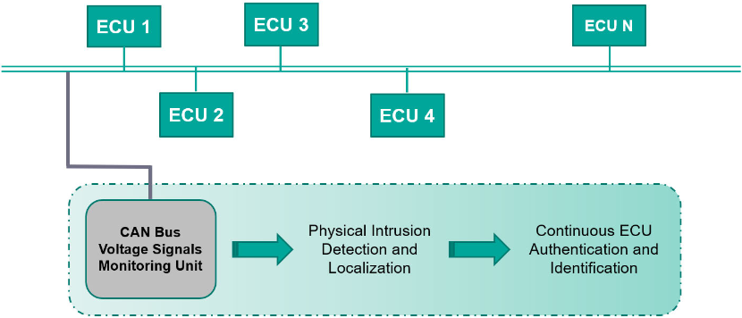

    上图展示了CAN-LOC系统，由两部分组成，第一部分是物理入侵检测和定位机制，该部分使用深度自动编码器检测是否在CAN总线上引入了额外的ECU，以及CNN多类分类器报告ECU插入的确切位置；第二部分是连续ECU认证和识别机制，使用CNN二进制分类器，可以检测ECU欺骗攻击。

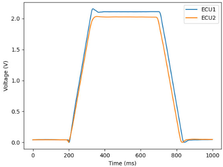

    上图为文章提供灵感，车辆中两个ECU的电压信号作为指纹识别非常有用，可以在CAN帧的上升沿和下降沿采样。

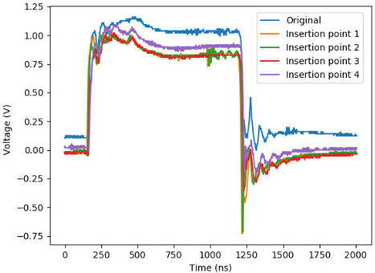

    上图展示了，在CAN网络中不同地方插入ECU，对于其他ECU的电压信号的影响。

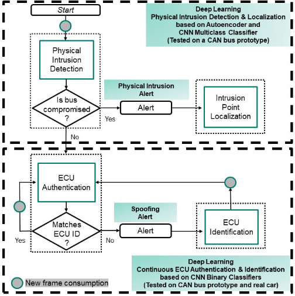

    上图展示了CAN-LOC系统的运行流程，在车辆启动时，通过物理入侵检测和定位机制，依据合法ECU的电压信号判断CAN总线是否被入侵并定位入侵点，若未检测到入侵，车辆启动后，利用连续ECU认证和识别机制，基于CAN总线传输的电压信号检测欺骗攻击。

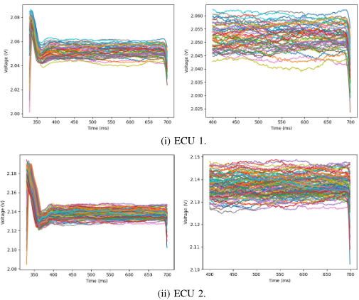

    上图展示从隐性1到显性0转换过程中返回的100个电压信号（由两个不同的ECU记录）。可以看出，数据显示出真实的噪声和电压波动，这在真实汽车中是预期的，但不会影响识别的准确性。

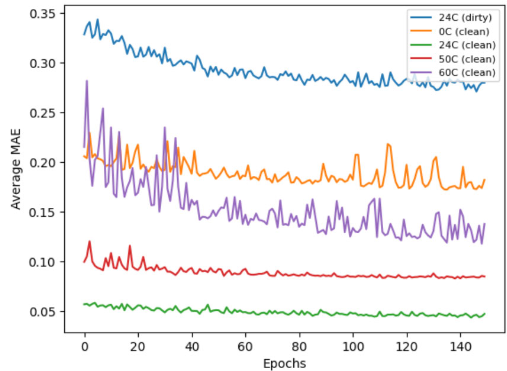

    上图呈现了干净和脏信号的平均 MAE 用于训练自动编码器的历元数的函数。可以看出，干净和脏信号的平均重建误差之间有很大的余量。（平均MAE是平均绝对误差，在本文物理入侵检测模块中，平均MAE用于评估自动编码器对电压信号的重建效果，自动编码器在训练阶段学习正常CAN总线拓扑下电压信号的模式，通过最小化重建误差优化模型，在训练过程中，使用两个仅包含良性数据的数据集，一个作为训练集，另一个作为验证集。训练自动编码器直至其在验证集上平均MAE达到最小，此时可认为自动编码器学习到了正常信号的特征模式）

# Intrusion Detection Using Transformer in Controller Area Network

    标题翻译为：在控制器局域网中使用 Transformer 进行入侵检测，2024年发表，文章链接：[在控制器局域网中使用 Transformer 进行入侵检测 |IEEE期刊和杂志 |IEEE Xplore](https://ieeexplore.ieee.org/document/10659904)。

    摘要部分：控制器局域网 （CAN） 协议的消息广播网络容易受到外部攻击。入侵检测系统 （IDS） 的持续开发旨在防止对车辆的恶意攻击。语言模型的时间序列分析已成为该领域的一种新方法，并为 IDS 性能的发展做出了重大贡献。然而，由于语言模型需要大量资源来处理，因此将其应用于实际车辆需要平衡模型性能与复杂性。在本文中，我们提出了一种高效的 IDS 模型，该模型使用基于 transformer 的技术，同时在有限的资源下进行作。所提出的 IDS 利用基于 transformer 的空间和时间数据分析机制，即使在数据有限的情况下也能快速响应攻击，并表现出出色的性能。由于 IDS 使用无监督学习，因此不需要在预处理期间标记输入序列。这种方法有助于保护车辆免受可预测和不可预测的攻击。此外，还可以扩展预测范围，使模型的性能在应对各种攻击场景时更加稳健。

    这篇文章提出了一个基于Transformer架构的IDS模型，通过无监督学习应对未知攻击，模型分别处理CAN ID序列和有效载荷序列，将二者输出向量相加，与实际CAN ID对比以判断是否存在攻击，训练时学习正常数据模式，评估时根据预测与实际CAN ID的匹配情况识别攻击，数据集使用的是韩国某实验室数据集，包含正常数据、洪水、模糊、故障攻击数据。数据处理的时候将十六进制的CAN ID和有效载荷转换为十进制，为避免二者取值范围重叠，给CAN ID加上256，并根据数据长度代码填充空位。神经网络方面采用Transformer网络，包含embeding层、positional层、多个transformer块以及线性层，transformer块由多头子注意力层、归一化层、前馈曾组成，与李沐所讲区别不大。在实验比较方面，与其他基于transformer的模型进行比较，在各种攻击检测中比较精度、召回率和F1值，同时在不同滑动窗口比较推理时间。

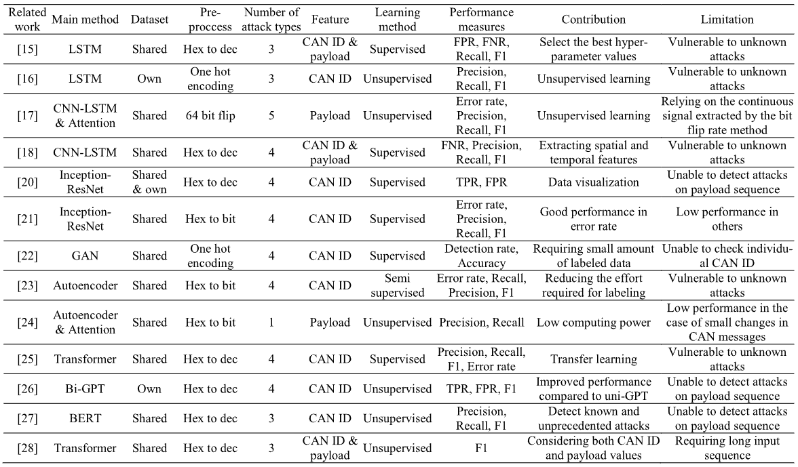

    上图为相关工作中提到的一些模型，作者对这些模型进行了总结归纳

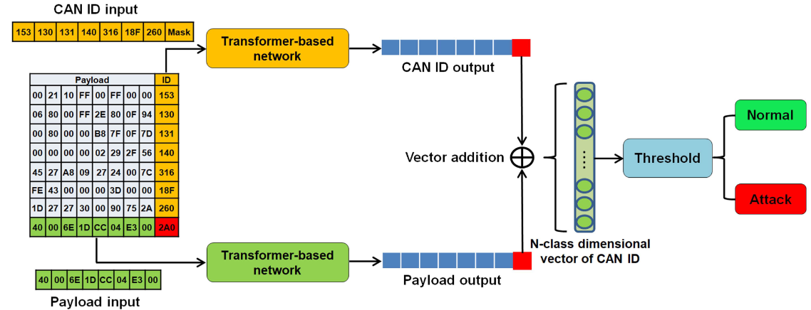

    上图为本文模型的一个流程图，该模型分别使用两个序列：CAN ID 和有效负载序列。CAN ID 序列由一系列 CAN ID 组成，而有效载荷序列包括 8 字节的有效载荷以及 CAN ID。CAN ID 序列最后一个时隙中的 CAN ID 与有效载荷序列最后一个时隙中的 CAN ID 相同。因此，两个输入序列的最后一个插槽都使用相同的 CAN ID 填充。CAN ID 序列（最后一个令牌替换为掩码令牌）和有效负载序列（最后一个令牌被删除）分别通过模型。通过将 CAN ID 序列输出和有效载荷序列输出的最后一个槽中的两个 CAN ID 向量相加来计算最终向量。通过将真实 CAN ID 与最终向量中的前*n* 个分数进行比较来确定攻击。在训练期间，正常的 CAN 数据通过模型来学习正常数据中的模式。在评估过程中，正常和异常的 CAN 数据都会通过模型。当正常的 CAN 报文通过模型时，预测的 CAN ID 与实际 CAN ID 匹配，遵循学习的模式。但是，当异常（受攻击的）CAN 报文通过模型时，预测的 CAN ID 与真实 CAN ID 不匹配，因为它偏离了学习的模式。

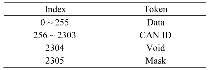

    因CAN ID和DATA在0-255之间由重叠，故将CAN ID全部加256，数据字段中的空白用2304填充

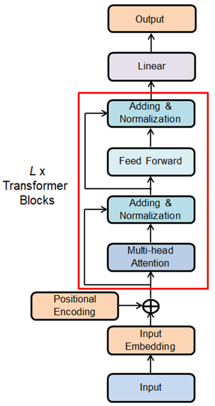

    上图展示了transformer模型的结构，几乎没有什么改变。

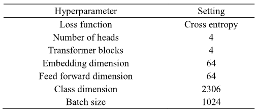

    该图展示了神经网络中的超参数设置。

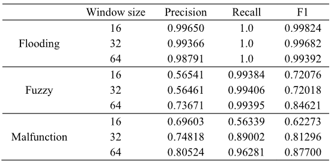

    该图展示了模型在不同攻击下不同滑动窗口的评估指标。文中之后篇幅均在和其他基于transformer的模型在不同攻击不同滑动窗口条件下比较精度、推理时间等等，故不作截图。

    没看出什么创新性，但可以从本文出发，阅读一些其他使用深度学习方法的文献。如下图所示。

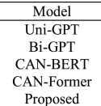

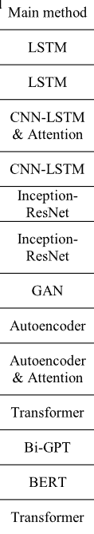

# Anomaly Detection for In-Vehicle Communication Using Transformers

    标题翻译：使用Transformer进行车载通信的异常检测，2023年发表，文章链接：[Anomaly Detection for In-Vehicle Communication Using Transformers | IEEE Conference Publication | IEEE Xplore](https://ieeexplore.ieee.org/document/10311788)。

    摘要部分：随着现代汽车基础设施的进步，车辆越来越依赖从大量传感器和电子元件接收的信号。无线技术使车辆和基础设施之间的通信成为可能，但也增加了漏洞面。恶意行为者可以远程破坏车辆的正常行为，造成车辆损坏或更糟的是，将人类生命置于危险之中。为了应对这些挑战，本文提出了一种基于 transformer 神经网络的入侵检测系统 （CAN-Former IDS），该系统可以预测 CAN 协议通信中的异常行为。以前的工作通常涉及对 CAN ID 序列的预测。在本文中，我们将同时分析 ID 序列和消息有效负载值。我们方法的优点是：1） 完全自我监督的训练，不需要标记数据，2） 输入标记之间的自学习交互，无需依赖手工制作的特征。transformer 神经网络经过训练以预测下一个通信序列，并通过将真实序列与预测的预期序列进行比较来识别异常通信。我们使用称为生存分析数据集的公开数据集评估了我们的方法，其中包含来自三辆不同汽车的 CAN 通信。

    本文提出了基于Transformer的CAN-Former IDS，通过无监督学习同时处理CAN ID序列与消息负载值。整体流程首先将CAN帧转换为令牌序列（ID+8字节负载），填充到固定长度（如90令牌），接着使用Transformer解码器预测下一个令牌，通过交叉熵损失优化，推理时比较预测序列与实际序列，差异超过阈值则判定为异常。阈值确定方法如下，从原始训练集中保留一个子集不参与训练，遍历所有可能的阈值，测试每个阈值在验证机上的性能，选择验证集上F1值最高的阈值作为最终阈值。神经网络就是Transformer块，一些超参数如嵌入大小128，多头注意力4头，10个Transformer块，dropout设0.25。数据集用的survival analysis data set，包含三种车型的CAN数据，将每个CAN帧拆分成ID和8字节负载，使用None令牌填充缺失部分以固定序列长度。与ResNet Autoencoder、LSTM Autoencoder、图基方法G-IDCS三种模型比较精度、召回率和F1分数。但模型对未见过的ID泛化能力有限。创新方面看不出。

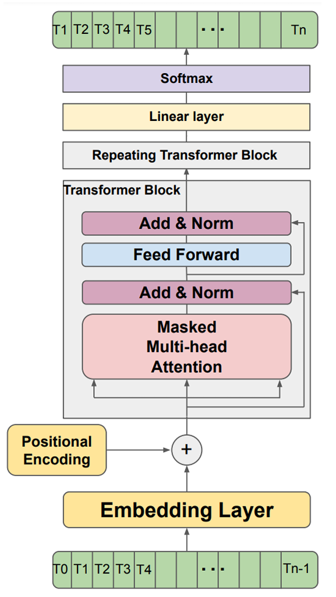

    本文的模型，和Transformer模型相比没啥区别。

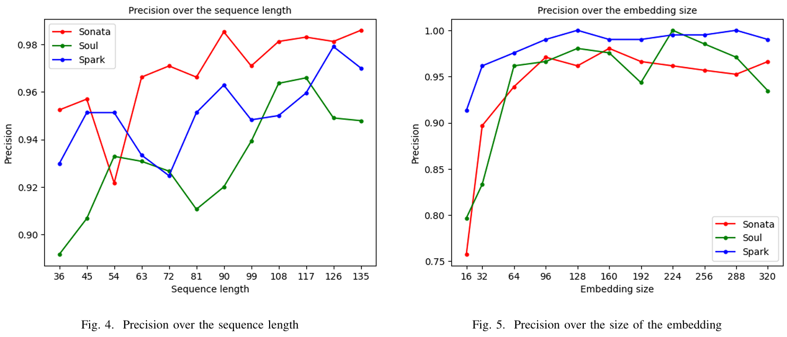

    不同序列长度和embedding大小在不同数据集上对精度的影响，最终实验选定序列长度99-135，embedding大小选128。

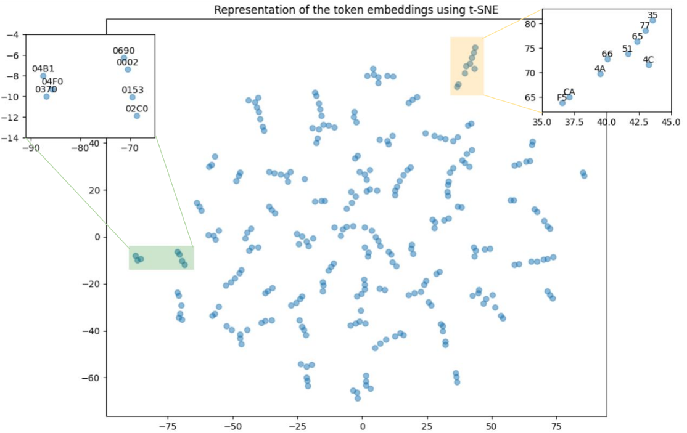

    上图为使用T-SNE 算法对 Hyundai Sonata 车型的令牌嵌入进行可视化的结果，将高维嵌入向量降维到二维空间，高频ID在嵌入空间中紧密相邻，表明模型可以捕获到ID之间的关联。绿色区域：聚集了高频出现的 ID（如 0x002、0x153、0x2C0），这些 ID 在正常通信中常共同出现。黄色区域：负载令牌（如 35、77、65）聚集，可能因其在消息负载中的位置相似（如最后一个字节）。可视化结果为模型为何能检测异常提供依据——异常序列的令牌嵌入会偏离正常聚类区域。

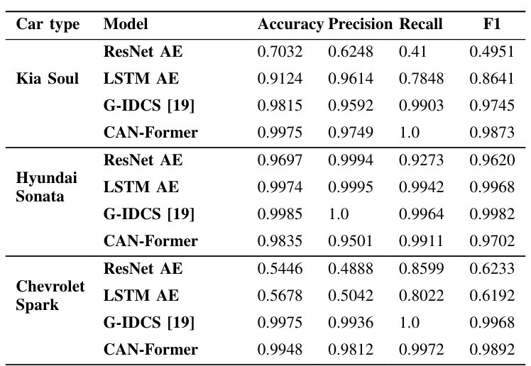

    与其他模型的比较。

# In-Vehicle Network Intrusion Detection System Using CAN Frame-Aware Features

    标题翻译：使用 CAN 帧感知功能的车载网络入侵检测系统，2023年发表，文章链接：[使用 CAN 帧感知功能的车载网络入侵检测系统 |IEEE期刊和杂志 |IEEE Xplore](https://ieeexplore.ieee.org/document/10287862)

    摘要部分：随着互联和自动驾驶汽车 （CAV） 的进步，驾驶员现在可以使用车道保持、巡航控制等便捷功能。车辆内配备的电子控制单元 （ECU） 通过控制器局域网 （CAN） 相互通信。但是，由于 CAN 不具备任何安全机制，它成为对手攻击的目标。有鉴于此，关于入侵检测系统 （IDS） 的大量研究都集中在检测此类恶意注入的 CAN 数据包上。然而，大多数现有的基于机器学习的 IDS 既不计算 CAN 数据包的确切时间间隔，也不利用计数器信息。精确的时间间隔是检测欺骗、模糊测试和重放攻击的关键功能，而计数器信息也是可以检测模糊测试和重放攻击的重要功能。因此，在本文中，我们提出了一种方法来提取两个了解 CAN 帧特性的检测特征：两个连续 CAN 数据包之间的帧间空间 （IFS） 和 CAN 数据有效载荷的计数器信息（即数据字段）。利用这些功能，我们引入了基于决策树的 IDS。我们使用流行的基于决策树的模型（如随机森林和极端梯度提升 （XGBoost））来评估所提出的特征。结果表明，我们提出的 IDS 可以检测到恶意注入的 CAN 数据包，在二进制分类中 F1 得分为 99.54%，在多类分类中为 97.99%，这比现有的基于机器/深度学习的 IDS 所达到的得分更高。此外，我们还会测量我们提议的 IDS 在在线和离线测试环境中的检测时间。

    文章使用机器学习中的基于决策树的随机森林模型和XGBoost模型。提出了两个点用于检测入侵，一是计算出数据帧之间的准确时间间隔IFS，二是通过比特翻转率计算出每个数据帧的counter值即排位确定CAN数据包的顺序。在数据预处理和特征提取环节，抽出了13个特征，分别是当前CAN帧的ID、当前CAN帧的数据长度DLC、前一个CAN帧的ID、后一个CAN帧的ID、前两位CAN帧的ID、后两位CAN帧的ID、与前一个CAN帧之间的IFS、与后一个CAN帧之间的IFS、第i个CAN报文的时间戳与相同CAN ID的前一个/下一个报文的时间戳的时间差、第i个CAN报文的计数器值与前一个/下一个与其ID相同的CAN报文的计数器值的差值、与前一个报文的IFS、该报文的类型class（正常或攻击）、该报文的具体攻击类型。使用一个黑客数据集和两个自建数据集进行训练和预测，与一些二分类模型和多分类模型进行了准确性以及帧处理时间的比较，

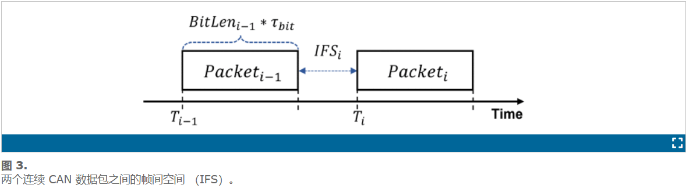

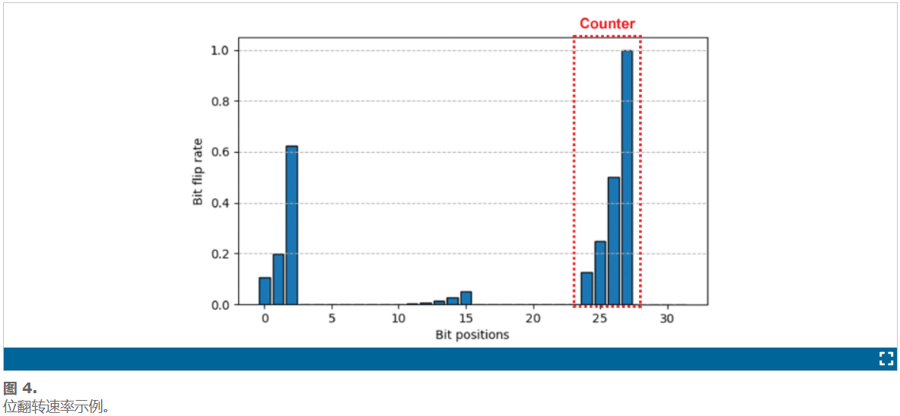

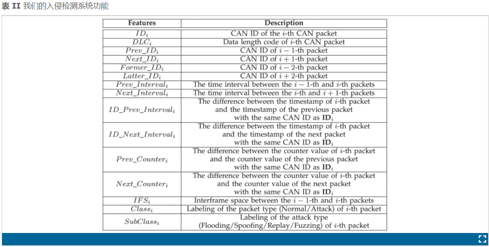

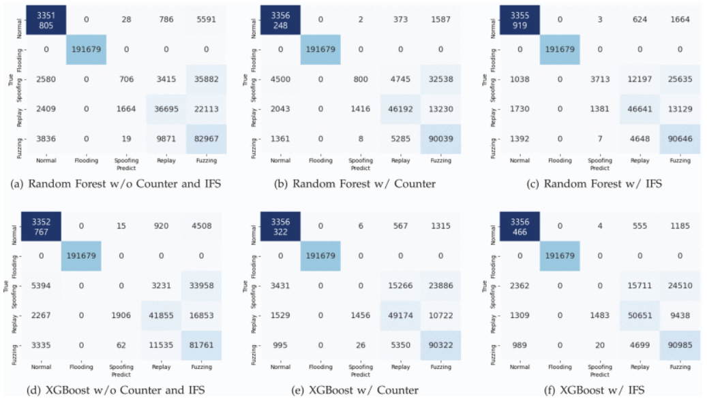

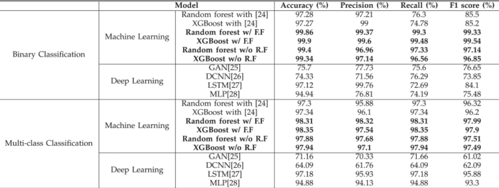

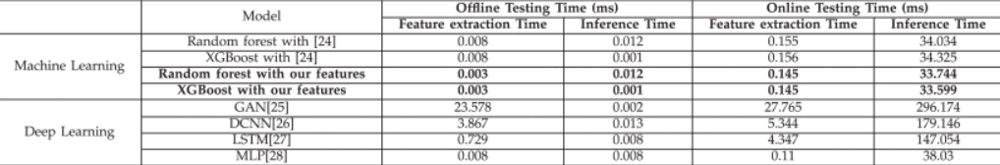

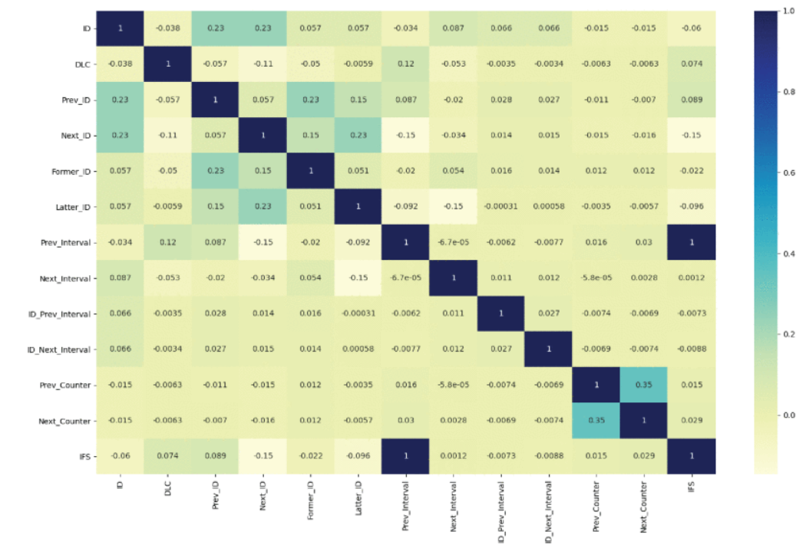

    特征之间的相关系数。

    文章并没有细说所使用的模型细节，仅仅只是介绍了随机森林概念如由多个决策树组成，XGBoost是一种基于Bagging的模型。在设计时解决了两个问题，如何计算 CAN 数据包之间的准确时间间隔和如何找到 CAN 数据包的顺序，一个是用IFS解决，另一个用的计算每个帧的counter值确定其的顺序。下图展示了怎么由IFS判别是否存在攻击报文。原文翻译是图 5 展示了正常和攻击场景下的 IFS（帧间间隔）示例。图 5 (a) 是正常 CAN 通信中出现的 IFS 示例。在此示例中，由同一 ECU连续发送的 ID_A 和 ID_B 两个 CAN 数据包之间的 IFS 是一个固定值（即 3 位时间）。ID_C 和 ID_D 同样由同一 ECU 发送，因为它们之间的 IFS 始终是一个固定值，但超过 3 位时间（例如 10 位时间）。图 5 (b) 展示了攻击示例：在 ID_A 和 ID_B 之间注入了攻击数据包。如果注入的攻击数据包包含比 ID_B 优先级更高的 ID_E，由于仲裁机制，ID_B 数据包的传输会被延迟，导致原本应为 3 位时间的 ID_A 与 ID_B 之间的 IFS 变为 6 位时间。此外，图 5 (c) 展示了 ID_C 和 ID_D 之间固定 IFS 被破坏的示例。因此，IFS 可作为入侵检测的特征。

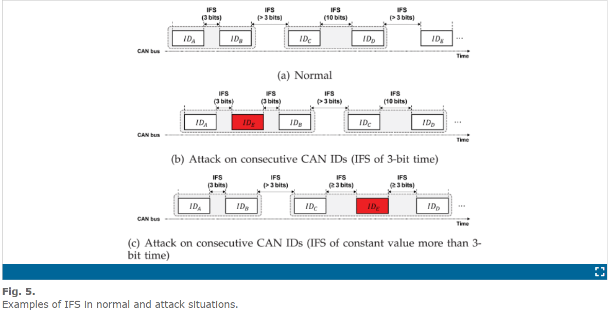

# HybridSecNet: In-Vehicle Security on Controller Area Networks Through a Hybrid Two-Step LSTM-CNNModel

    标题翻译：HybridSecNet：通过混合两步 LSTM-CNN 模型实现控制器局域网上的车载安全，2024年发表，原文链接：[HybridSecNet：通过混合两步 LSTM-CNN 模型实现控制器局域网的车载安全性 |IEEE期刊和杂志 |IEEE Xplore](https://ieeexplore.ieee.org/document/10556797)

    摘要部分：现代智能汽车 （IV） 是一个复杂的技术奇迹，它严重依赖控制器局域网 （CAN） 总线系统来实现不同电子控制单元 （ECU） 之间的无缝通信。然而，CAN 总线系统缺乏用于身份验证和授权的安全机制，使其容易受到各种攻击。恶意行为者可以在没有保护的情况下自由广播 CAN 消息，使系统容易受到 DoS、模糊测试和欺骗攻击。因此，设计保护现代车辆免受此类威胁的方法至关重要。在这篇研究论文中，我们介绍了 HybridSecNet，一种用于入侵检测的混合两步 LSTM-CNN 模型，这是一种基于深度学习的架构，专门用于增强控制器局域网 （CAN） 的车载安全性。HybridSecNet 包括两个分类阶段：第一阶段采用长短期记忆 （LSTM） 将输入数据分类为正常或受攻击，第二阶段使用卷积神经网络 （CNN） 进一步将攻击分类为特定类型。这种两步法显著提高了分类的准确性和可靠性，在准确性、精度、召回率方面产生了显著的结果，并且 CAN 总线网络攻击的 F1 分数约为 99.5%。与现有单步模型的比较分析强调了我们提出的模型的优越性，证明了它有可能彻底改变现代智能汽车领域的车载安全。

    文章提出了一个由基于LSTM和基于CNN模型组成的模型HybridSecNet，在数据处理阶段，使用的car hacking数据集，使用大小为n的窗口，选取了十个特征，分别为CAN ID、D0-D7、标签，其中标签0代表正常消息，1代表攻击消息。模型的第一部分是基于LSTM的分类器，该架构由第一层的64个LSTM单元和第二层的32个单元组成，使用64的batch size，模型最后一层是n*1的密集层，采用学习率为0.001的Adam优化器，均方误差MSE作为损失函数，激活函数用sigmoid，训练10个epoch。第二部分使用的基于CNN的分类器，由Sequential、Conv1D 和 Dense 层组成，使用ReLU激活卷积层，再使用最大池化层进行下采样，展平层为最后全连接层准备数据，该模型使用Adam优化器、分类交叉熵损失函数和分类准确率作为评估指标进行训练。在实验部分，首先对第一部分进行评估，展示了Loss在epoch增加的变化以及假阳性率与真阳性率之间的关系做的ROC图，接着评估了LSTM+CNN的整体效果，使用了准确率、精度、召回、和F1值作为评估指标，再将该模型与仅基于CNN的模型进行了比较，最后再将该模型与其他使用car hacking数据集的模型比较精度和处理时间等方面。

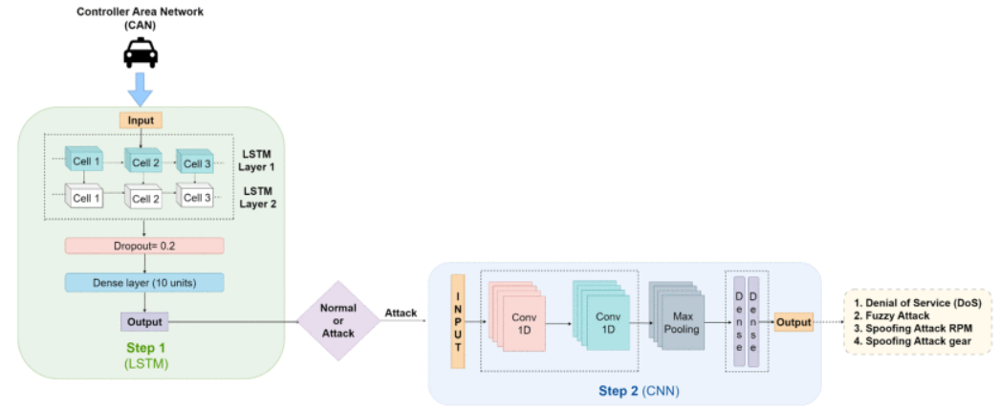

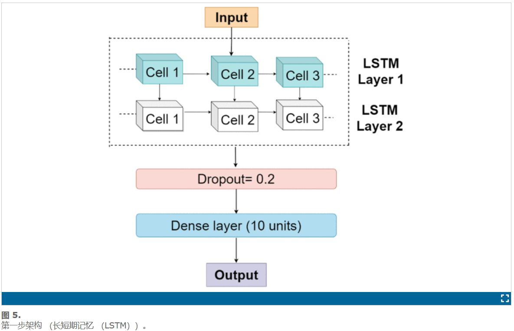

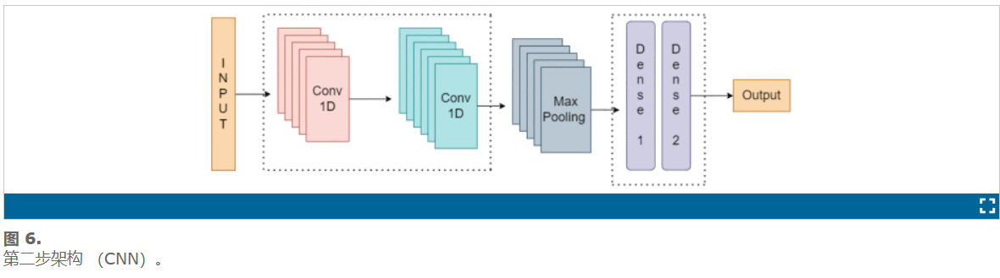

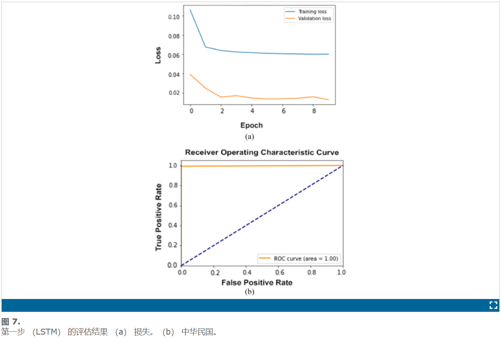

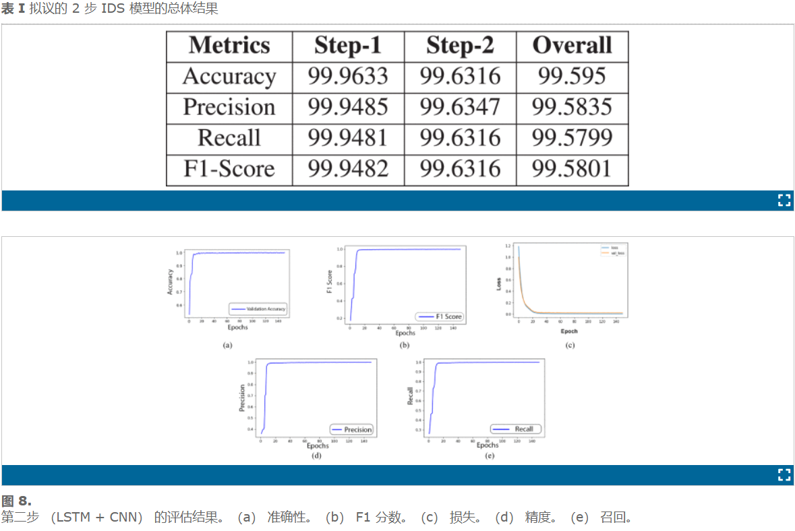

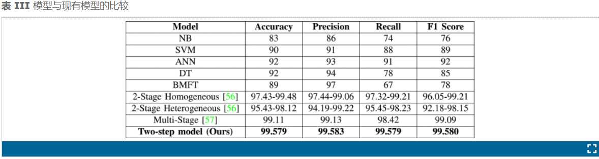

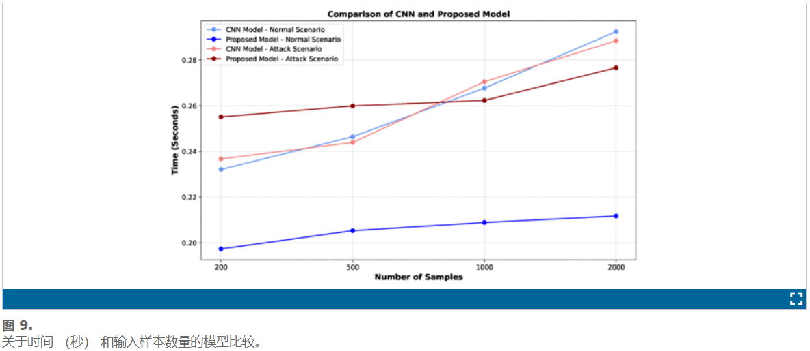
