# 智能网联车网络安全研究综述

[原文PDF](智能网联车网络安全研究综述_吴武飞.pdf)

​	首先介绍了智能网联车的结构现状和特点，阐述了车载网络安全面临的设计约束和挑战。其次结合车载网络当前面临的功能安全和信息安全问题，介绍了今年来国内外最新研究进展。最后从车载网络结构特点出发，从标准建设、功能安全和信息安全3个方面，指出了一些重要的研究方向。

## 一、引言

​	智能网联车电子系统逐步演变为集感知、计算、网络和控制为一体的信息物理融合系统，系统复杂化和对外通信接口的增加会使车载网络更易受到攻击。汽车安全问题包含功能安全和信息安全两方面。出于成本和性能的均衡考虑，当前车载网络存在带宽受限、强实时和确定性时延的要求和特点。

## 二、背景介绍

#### 2.1 智能网联车车载网络介绍

​	智能网联车是一个异构分布式实时系统，车载电子控制单元ECU由异构网络（控制器局域网络CAN、本地互联网络LIN）连接，主要特征有：丰富的对外接口、大量实时数据、异构网络环境、信息安全保护机制缺乏。

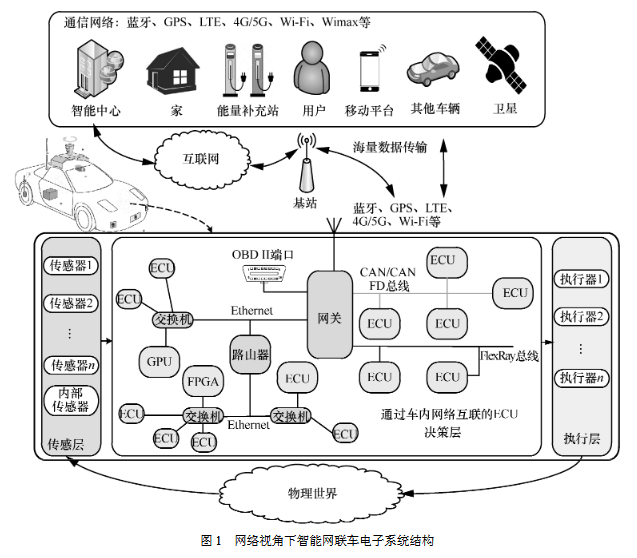

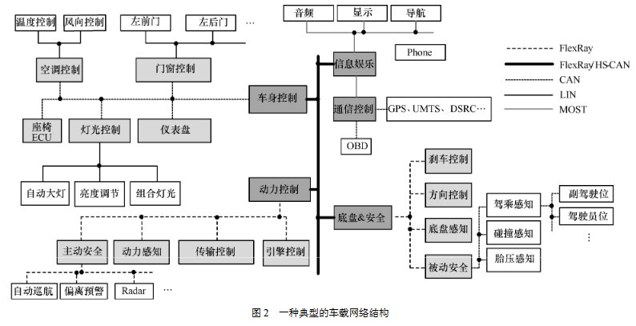

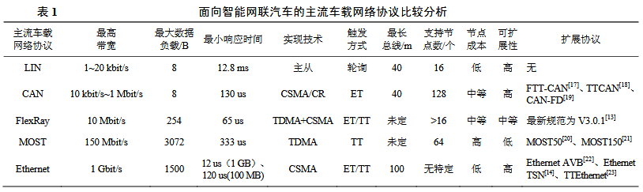

#### 2.2 车载网络的分类

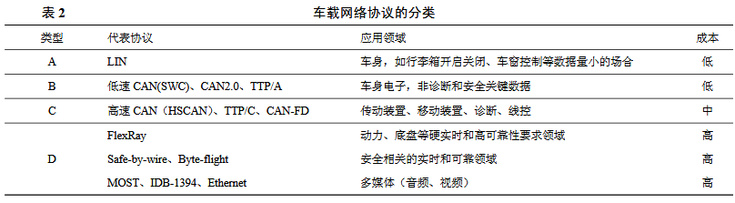

​	车载网络可分为时间触发TT和事件触发ET。

​	TT是指以时间点为通信触发条件，一般通过定时和时间同步方式实现。

​	ET是指通信触发条件，即某一事件发生。如汽车安全气囊系统检测到碰撞，通过触发传感器所在ECU发送数据帧引爆气囊。

当前车载网络中TT型网络主要有TTCAN、TTEthernet、TTP/C等。TT型车载网络具有带宽高、传输时延确定的特点，弥补了ET型在确定性时延的不足。

## 三、车载网络信息安全问题分析

#### 3.1 严峻的信息安全威胁

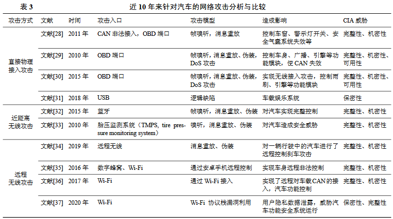

​	直接物理接入攻击主要通过非法接入CAN、车载诊断系统OBD诊断接口等方式。

​	近距离无线攻击主要通过蓝牙和无线传感器信道非法接入的方式。

​	远程无限攻击主要通过WIFI和移动数字蜂窝网络端口实现非法接入。

#### 3.2 缺乏信息安全保障的车载网络

​	现有的车载网络协议如CAN和FlexRay等在设计之初缺乏安全机制设计，使得车载网络易受到嗅探、伪造、修改和重放等类型的攻击。其脆弱性体现在以下方面：

​	脆弱的接入控制：物理层为双绞线或同轴电缆，接入简单、缺乏异常接入检测功能。

​	无数据加密保障：内部消息传输只根据功能编码，缺乏加密保护。

​	无消息认证机制：消息仅通过消息ID进行标定和作为接收过滤，易遭受拒绝服务DoS、重放、伪造等攻击。

#### 3.3 丰富的网络安全攻击入口

​	1.来自传感层（物理层）的攻击。未来汽车配备激光雷达、毫米波雷达、摄像头和GPS等传感器，通过物理层攻击将成为新威胁。

​	2.非法访问（数据链路层）。车载网络缺乏数据加密和消息验证，攻击者一旦访问网络设计即可实施攻击。数据链路层攻击模式有帧注入、帧伪造、帧嗅探、暂停和DoS攻击。

​	3.来自接口（应用层）的攻击。攻击入口包括蓝牙、OBD\_II、WIFI等。此类攻击没有非法访问节点和明显数据帧异常难以被检测。针对此类攻击，当前研究集中于机器学习的入侵检测方法设计，存在计算资源消耗过大、缺乏测试数据集及模型评估等问题。

#### 3.4 功能安全保障下的信息安全问题

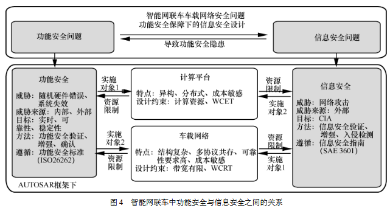

​	总结得出四点功能安全保障下的车载网络信息安全设计面临的挑战和约束：

​	1.计算、存储及通信带宽资源的约束。

​	2.复杂异构的软硬件结构不仅给功能安全和信息安全增加了不确定因素，也给系统功能安全保障测试验证增加难度。

​	3.成本和性能的均衡考虑，ECU的计算和存储资源有限，部署的高成本可能导致网络安全部署被给予低优先级，由于成本约束，传统信息的网络信息安全增强方案无法部署于汽车环境。

​	4.车载网络对功能安全设计的约束表现为消息传输的实时性、端到端时延边界、系统任务可调度性等。针对可调度性分析的研究主要集中在探索通信时延的上界、网络消息可调度性分析、满足确定性时延分析等方面。

## 四、车载网络信息安全增强技术研究进展

#### 4.1 车载网络数据加密技术

​	传统的消息加密与认证技术在车载网络环境下面临体系结构异构、带宽和计算资源受限等问题。为减少加密运算带来的额外时间开销，通常采用轻量化、硬件加速等方式，如利用可编程逻辑器件进行高级加密标准AES、椭圆曲线密码编码学ECC运算加速、通过即现场可编程门阵列PFGA实现裁剪版的哈希算法、将多个消息传输一个MAC等。

​	针对计算资源紧张和i西澳西加密带来的时间开销问题，Wang等采用添加硬件模块方式解决加密算法时间问题，缺点增加了硬件部署的成本。

​	应对多种车载ECU的漏洞和攻击模型，Siddiqui等提出基于硬件的安全可信框架，在车载CAN上实现基于轻量级物理不可克隆函数PUF的双向认证和非安全通信信道上的安全加密，缺点是导致网络协议异常复杂。

#### 4.2 车载网络消息认证技术

​	近年来，车载CAN的多种轻量级消息认证协议被提出保护车辆免受伪装攻击。该协议最初由Herrewege等提出。Jo等提出MAuth-CAN可在不修改CAN硬件控制器的同时实现网络带宽消耗与防止伪装攻击之间的均衡。Kang提出在CAN中使用单向哈希链的轻量级源认证协议，具有攻击弹性树算法，可通过ＥＣＵ的固件更新实现部署。

​	轻量级消息认证协议可解决CAN协议缺乏安全认证设计的问题，现存在问题在于如何在提高消息认证安全性的同时避免因通信带宽消耗而导致消息可调度引起的功能可靠和实时问题。

#### 4.3 车载网络异常入侵检测技术

​	相较于消息加密、访问控制、协议认证等信息安全增强手段，入侵检测具有占用带宽资源小、便于现有车辆部署的特点，更适合资源和成本受限的车载网络。

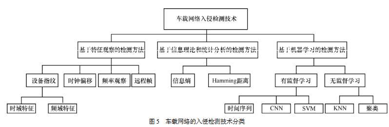

​	基于特征观察的检测方法针对特定攻击模型能取得较高的检测精度，具有响应时间短、网络带宽开销小的特点。现有研究中存在以下问题：检测方法往往针对特定攻击模型；检测效果稳健性不强（有诸多前提条件，缺乏对汽车状态的感知）；缺乏对检测响应时间的评估及对功能安全保障的影响。

​	现有基于信息理论的车载网络入侵检测方法研究往往忽略了汽车不同状态带来的车载网络信息熵抖动对检测结果的影响，其检测模型在有限汽车状态下具有较高的检测精度，但对不同汽车的稳健性有待提高。

​	机器学习对于车载网络未知攻击模型的入侵检测具有较好的效果，但在车载网中，现有基于机器学习的入侵检测方法在如何降低计算复杂度和对车载网络通信带宽的消耗上是一个有待解决的问题，同时提高检测精度、降低误报率、缩短响应时间和提高稳健性也是改善的方向。

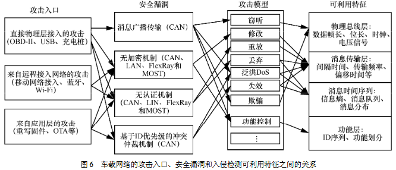

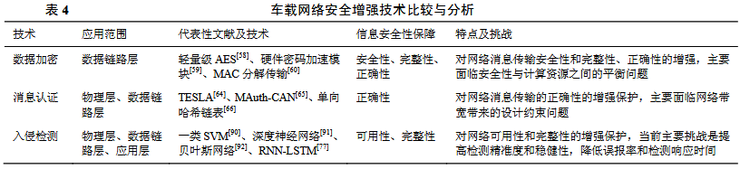

## 五、分析和总结

​	结合智能网联车发展趋势及当前车载网络安全方面的最新研究进展，提出了一些开放性问题。

#### 5.1 如何提高入侵检测精度、降低响应时间

#### 5.2 如何实现精准的网络安全测试评估

#### 5.3 如何应对未知的智能网联车网络攻击

#### 5.4 如何实现网络安全增强与资源消耗的均衡

#### 5.5 如何制定及时有效的智能网联车信息安全标准

## 六、结束语

​	本文首先介绍了智能网联车中车载网络协议现状及分类情况，随后总结了当前车载网络安全问题对比分析了车载网络安全增强技术现状，最后对未来车载网络安全技术的发展和研究进行了总结和展望。

# 智能网联汽车的车载网络攻防技术研究进展

​	智能网联车是一种由ECU组成的复杂分布式异构系统。攻击者可以从各个接口攻击智能网联车，故车载网络安全成为安全研究的焦点之一。在介绍网联汽车整体结构、ECU、CAN总线和车载诊断协议的基础上，首先介绍目前车载网络协议的逆向工程技术发展，然后从攻、防两个角度展开：一方面讲车载网络攻击向量和主要攻击技术，另一方面讲现有的防御技术，最后展望未来研究方向。

**关键词：**智能网联汽车；车载网络；逆向工程；入侵检测；协议安全增强

## 一、基础知识

#### 1.1 相关术语

#### 1.2 智能网联汽车整体结构

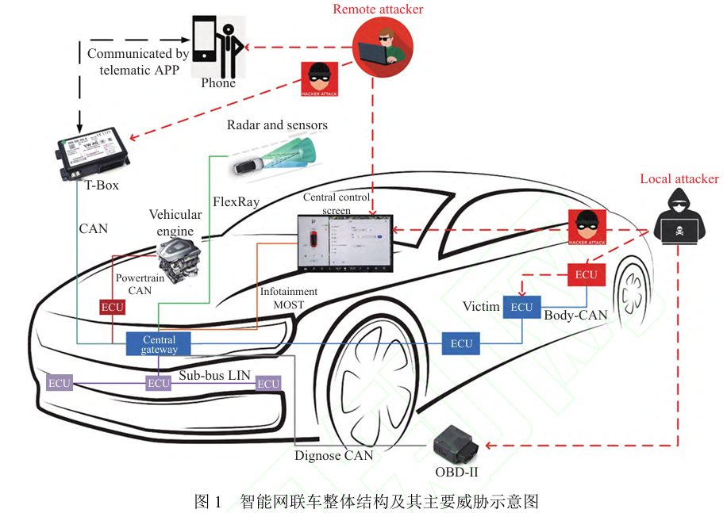

#### 1.3 ECU和车载网络协议

**1.3.1 ECU**

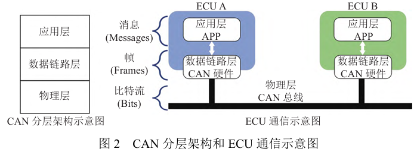

**1.3.2 CAN协议**

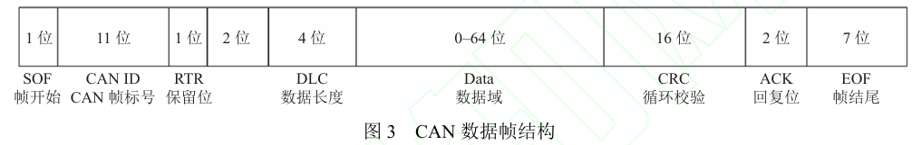

**1.3.3 车载诊断协议**

## 二、车载网络攻防研究方向

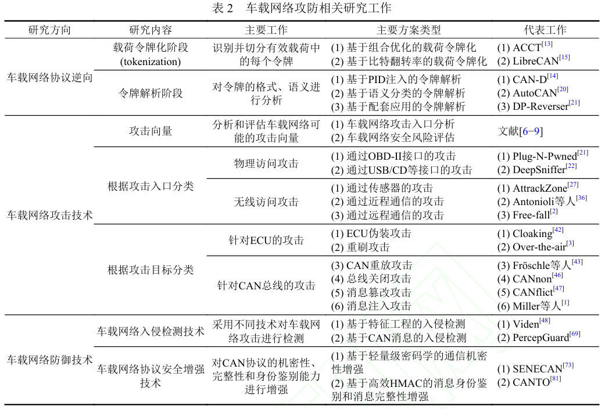

## 三、车载网络协议逆向

​	汽车行业厂商出于各种原因，一般不公开其车载网络相关协议实现细节。无论是研究者还是攻击者，要想推测出消息的具体语义都绕不开车载网络协议的逆向。

#### 3.1 协议逆向过程

​	CAN信号是车载网络协议逆向的基本单位，作为一个令牌(token)。令牌是车载网络协议逆向的基本单位，主要包括以下类型：(1)物理值：用于表示实时的车辆动态，如车速、转弯角等。(2)状态值：表示一组有限的状态，例如车门打开或关闭。(3)计数器：在特定范围内作为循环计数器的信号。(4)校验码：有效载荷还包括额外的校验码，通常作为有效载荷的最后一个信号。

​	车载网络逆向的**输入**是原始的CAN数据流，获取CAN数据流最常用的方法是将CAN数据记录仪通过ODB-II接口连接到CAN总线上。车载网络逆向的**输出**是DBC格式的文件，DBC文件是一种CAN信号信息的可读文件，包含了CAN信号的位置、语义和格式以及取值范围等信息。车载网络协议逆向的**目的**是定位CAN信号在CAN数据帧中的位置，将CAN数据帧切分为CAN信号, 该过程称为**载荷令牌化**；然后再分析每一个CAN信号的语义和格式, 该过程称为**令牌解析**。

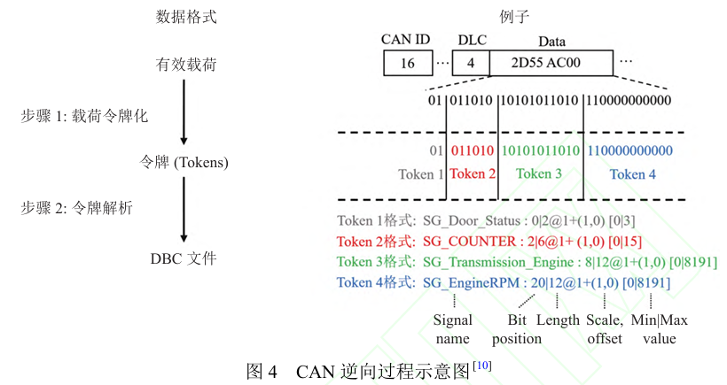

#### 3.2 载荷令牌化

​	载荷令牌化的目标是识别CAN帧的有效载荷中的每个CAN信号。相关方法可分为两类：

​	(1)基于组合优化的载荷令牌化：基于组合优化的方法设置一个组合优化分数函数，在令牌组合候选集中选择使该分数函数最大的令牌切分组合。

​	(2)基于比特翻转率的载荷令牌化：该方法思想是，不同CAN信号之间的比特翻转率很可能不同，一个CAN信号内的比特翻转率接近。

#### 3.3 令牌解析

​	经过载荷令牌化过程，CAN信号在有效负载中的位置已知，但其语义含义和格式尚未被翻译。令牌解析阶段 将解析CAN信号的格式和语义，输出DBC文件。令牌解析相关工作可以分为如下3类：

​	(1)基于PID注入的令牌解析：通过向OBD-II接口注入参数标识(PID)，并观察CAN数据流的变化，分析CAN 信号的语义。这是很多令牌解析的基础方法，一些其他类别的工作也需要结合基于PID注入的令牌解析方法。

​	(2)基于语义分类的令牌解析：该方法利用语义相似的CAN信号组的内在属性，以及这些组之间语义的联系解析CAN信号。

​	(3)基于配套应用的令牌解析：智能网联汽车的配套应用是运行在移动端和桌面端的应用程序，可以与车载网络进行交互。

#### 3.4 小结

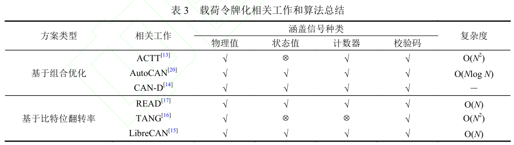

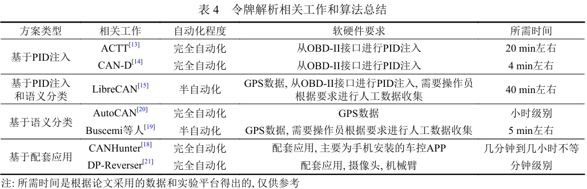

## 四、车载网络攻击技术

#### 4.1 概述

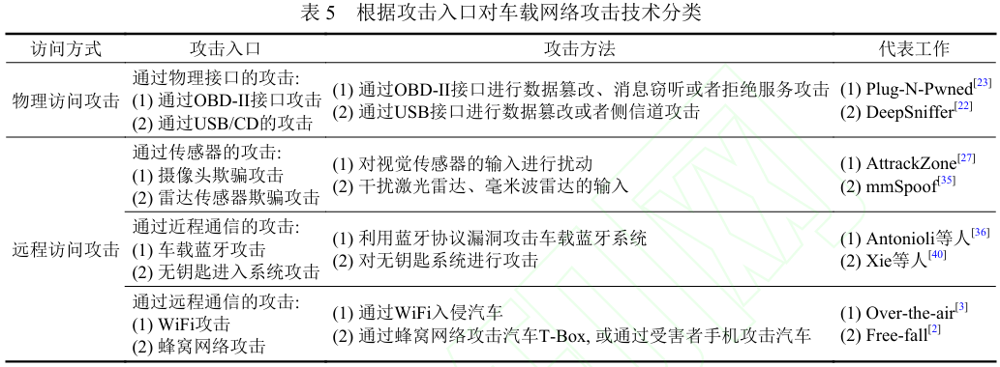

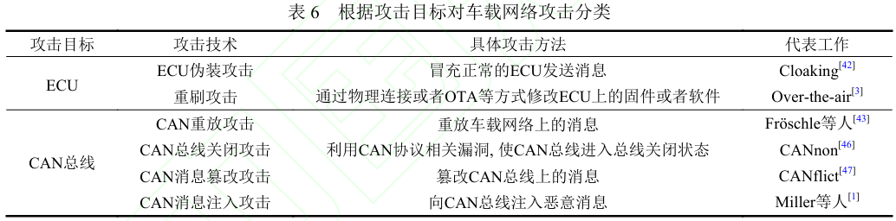

​	部分攻击者入侵CAN总线后，可能执行以下恶意功能：(1)数据窃取，窃取驾驶者相关信息。(2)控制车辆，发送恶意CAN数据包破坏车辆驾驶行为。(3)数据欺骗，向驾驶员或自动驾驶系统反馈错误信息，导致错误的驾驶决策。

#### 4.2 攻击入口

**4.2.1 物理访问攻击**

​	OBD-II接口是一种汽车故障检测和诊断接口，通过该接口可以获取车辆实时和历史数据，但其设计之初未考虑安全问题，攻击者可以利用该漏洞进行攻击。车载娱乐系统配备的USB接口一旦被攻击者获得了访问权限，也可以执行攻击。

**4.2.2 无线访问攻击**

​	无线访问攻击可分为通过传感器的攻击、通过近程通信的攻击和通过远程通信的攻击。

**通过传感器的攻击：**

​	智能网联车需要不同功能的传感器实时获取周围环境信息，这些传感器的测量结果作为自动驾驶系统的输入，对行驶安全至关重要。传感器攻击发生在自动驾驶的信息收集阶段。

​	(1)摄像头欺骗攻击：摄像头是自动驾驶系统进行环境感知、即时定位与地图构建(SLAM) 的最重要传感器

​	(2)雷达传感器欺骗攻击：激光雷达通过发射激光并捕获反射来计算与障碍物的距离，是智能网联汽车重要的传感器之一。激光雷达可获取周围环境的三维点云数据，并用于感知和识别障碍物、道路标志等关键任务。

**通过近程通信的攻击**

​	智能网联汽车需要结合蓝牙、RFID等近程通信技术完成相应的功能，例如无钥匙进入等功能，这些近程通信接口也为攻击者带来了新的攻击面。

​	(1)车载蓝牙攻击：一些研究者已经充分论证了蓝牙的安全威胁，然而针对车载蓝牙攻击的研究相对较少

​	(2)无钥匙进入系统攻击：无钥匙进入系统通过无线射频技术(RFID)或蓝牙技术实现车辆的解锁和上锁功能，使车主无须金属钥匙即可打开汽车。针对传统汽车的无钥匙进入系统，已经有攻击者通过无线中继攻击恶意解锁并盗窃车辆的例子。随着车辆智能化程度不断提高，其暴露的攻击面不断增加。

**通过远程通信的攻击**

​	智能网联车需要通过蜂窝网络等远程通信技术完成相应功能，这就给了远程攻击者提供了较大的攻击面。

​	(1)WiFi攻击：WiFi是智能车进行OTA升级的重要入口，也往往被攻击者利用

​	(2)蜂窝网络攻击：车主可通过手机远程操控智能车，若车主手机被黑客操控，黑客可控制车空App连接并访问汽车。

#### 4.3 攻击目标

​	攻击者通过物理访问或无线访问方式入侵车载网络后，其最终目标是攻击车载网络及其组成部分如ECU。按攻击目标分类，最终目标可能是ECU或者CAN总线。

**4.3.1 针对ECU的攻击**

​	(1)ECU伪装攻击：CAN总线具有广播的特性且CAN消息中不包含收发者的相关信息，如果攻击者可以访问CAN总线，则其可以获取总线上所有消息，在学习ECU的行为方式(如CANID，传输速率，CAN消息有效载荷的范围等)后，攻击者可以构造相同的信息冒充ECU发送消息。

​	(2)ECU重刷攻击：重刷攻击指攻击者试图在智能车中修改ECU的软件或固件，可以通过物理接入ECU或者通过网络连接实现。

**4.3.2 针对CAN总线的攻击**

​	(1)CAN重放攻击：目标是捕获CAN总线上的有效信息，不修改或者添加恶意payload后再重新发送该消息，造成CAN消息的延迟或不可用从而影响整个CAN总线。

​	(2)CAN总线关闭攻击：是一种针对CAN总线的拒绝服务(DoS)攻击，目的是使CAN总线进入总线关闭状态，进而让通信受阻。攻击主要方式是向CAN总线发送大量的错误消息，使CAN控制器错误地认为总线上发生了严重的通信错误，触发总线关闭机制，导致整个CAN总线通信中断。

​	(3)CAN消息篡改攻击：攻击者通过物理方式或者远程访问的方式对CAN总线上传输的数据进行篡改，发送篡改后的数据包来干扰车辆运行，执行恶意功能。

​	(4)CAN消息注入攻击：攻击者使用其控制的恶意ECU模拟其他合法设备发送伪造的CAN消息，导致其他设备产生错误的行为。

#### 4.4小结

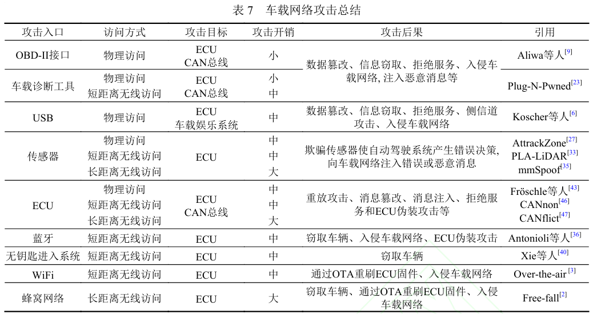

## 五、车载网络防御技术

#### 5.1 目标和挑战

​	目标是抵御不同能力攻击者从各个层次发起的不同种类的车载网络攻击。攻击产生的主要原因是车载网络普通缺乏信息加密和认证机制。

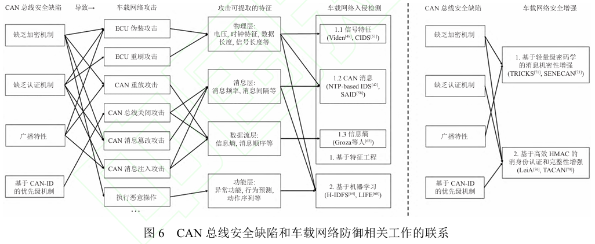

​	挑战主要有以下4点：(1)与现有协议的兼容性。(2)实时性约束。(3)ECU算力约束。(4)ECU源代码约束。

#### 5.2 车载网络入侵检测技术

**5.2.1 基于特征工程的入侵检测**

​	(1)基于信号特征的入侵检测工作：ECU具备一些固定的信号特征如电压特征，恶意ECU无法改变电压这一硬件特征。此外，车载网络攻击还具有一些独特的信号特征，如时钟特征、信号长度等。

​	(2)基于CAN消息的入侵检测：此类工作主要实现在消息层，其中一种方法是基于网络参数模型的车载网络入侵检测，通过检测CAN消息中的参数变化来检测潜在的入侵。该方法对计算资源要求较低，但对于消息注入攻击效果较差，因消息注入攻击可以是正常消息，其网络参数不会有任何变化，同时对非周期性的操作检测率很低。另一种方法是基于消息语义的入侵检测，其根据消息的语义和车辆状态、外部环境等信息判断消息是否为恶意。

​	(3)基于信息熵的入侵检测：通过对网络流量的熵值进行分析来判断是否存在入侵行为。任何不正常的行为都可能导致网络熵值的显著变化。

**5.2.2 基于机器学习的入侵检测**

​	(1)基于传统机器学习的入侵检测：传统的机器学习方法，包括支持向量机、决策树、随机森林和多层感知机，被广泛运用于车载网络入侵检测。缺点是计算复杂度较高，还需要大量的数据集来训练模型，而且有价值的数据集很少，尤其是有攻击或异常流量的数据集。

​	(2)基于深度学习的入侵检测：与前者相比，避免了复杂的特征提取步骤。

#### 5.3 车载网络协议安全增强技术

**5.3.1 基于轻量级密码学的通信机密性增强**

​	车载网络普遍缺乏机密性设计，CAN总线广播的特性且缺乏加密机制，导致了CAN总线容易遭受ECU伪装攻击、消息篡改攻击等。ECU的算力较低，且CAN实时性要求较高，因此无法使用传统开销较大的密码学算法。

**5.3.2 基于高效HMAC的身份鉴别和消息完整性增强**

​	基于哈希的消息认证码是消息认证的重要方法之一，哈希函数是一类单向函数，具有不可逆性。在CAN标准中，没有消息认证机制，但每个消息发送方都包含一个唯一标识CANID，可根据CANID产生一个消息摘要，接收消息的ECU再根据该消息摘要进行校验，从而鉴别消息发送者的身份。

#### 5.4 小结

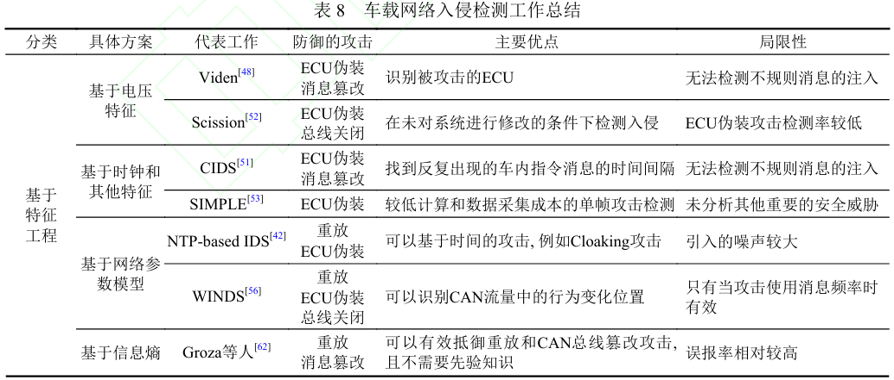

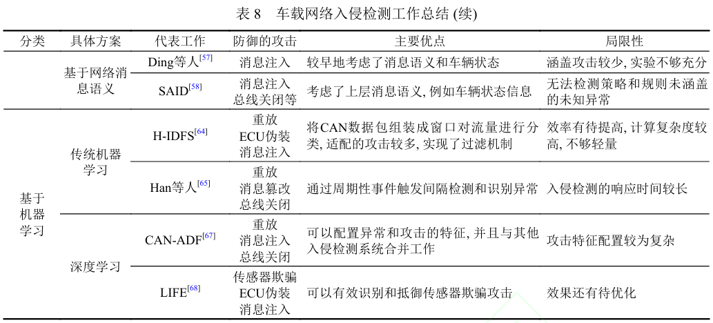

​	入侵检测研究还存在一些局限性，包括：

​	(1)现有大多数入侵检测系统仅使用一种类型的车辆数据(如传感器、CAN帧或OBD-II消息)来检测异常，没有充分运用各类信息。

​	(2)现有工作大多基于单一的技术或算法，没有很好地规避单一方法的缺点，多个方法混合使用，扬长避短，可能会达到更好的效果。

​	(3)现有工作中大多数没有充分利用汽车的场景信息，汽车是一个与驾驶者和环境不断交互的系统，充分利用这些不断变化的场景信息对车载网络的入侵检测工作十分重要。

​	(4)受限于时间和成本, 大多数现有工作的实验平台受限，测试不够充分。

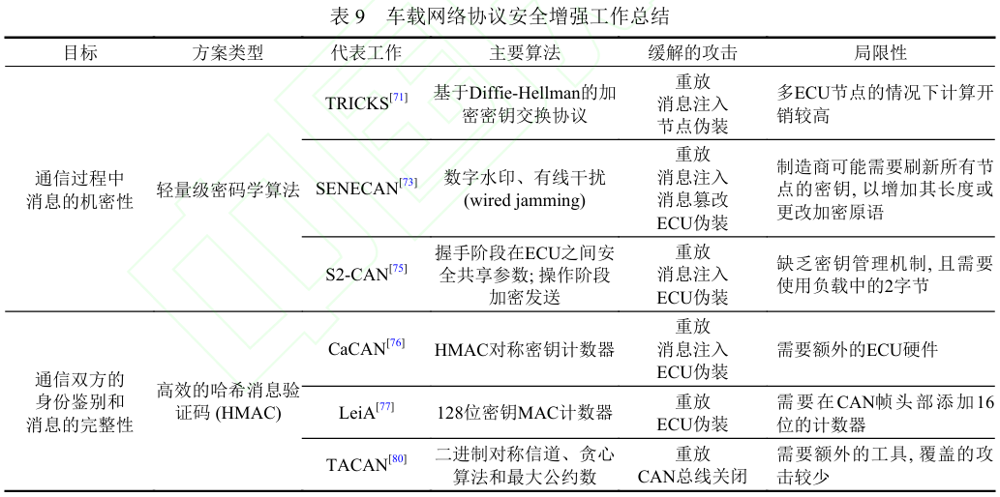

​	车载网络协议安全增强技术还存在一些局限如：

​	(1) 一些方案与现有CAN协议不兼容。车载网络协议安全增强方案不兼容导致厂商需要重新设计ECU的固件，对于供应商来说，推出新固件的成本是很高的。此外，这样的改动需要不同供应商之间进行大量的协调工作，以确保不同ECU之间可以互操作性，对于厂商是很难接受的。

​	(2) 延迟和开销较大。虽然这些延迟可能对大多数通用操作系统是可以接受的，但是车辆操作有严格的实时约 束，较高的延迟和开销很难被接受。

## 六、车载网络攻防技术研究展望

​	根据本文的总结, 车载网络的攻防研究面临如下几个挑战

​	(1) 通用性和性能更强的车载网络协议逆向：当前的车载网络逆向技术存在通用性不足的问题，其适配的车型 有限。虽然一些工作在实验中可以取得较好的性能，但是其性能表现在不同车型上差别较大。此外，一些令牌解析的工作是半自动化的，需要专业人员介入，其自动化程度有待进一步提高。

​	(2) 实时性更强的安全系统：汽车系统需要及时做出相应决策，因此ECU的实时性要求较高。一些安全攸关的 系统往往采用实时操作系统，但对于实时操作系统的攻防研究还相对较少。此外，一些ECU算力有限，因此无法部 署时延和开销较高的安全系统。

​	(3) 向后兼容性的车载网络协议安全增强方案：很多车载网络协议安全增强工作需要对CAN等已经广泛部署的车载网络协议进行更改，这可能造成安全增强后的车载网络协议与旧款车辆的相关协议不兼容，不满足兼容性是很多安全方案在工业界无法大范围部署的重要原因之一。

​	(4) 统一的车载网络安全测试标准和实验平台：虽然智能网联汽车在发售前都经过严格的网络安全测试，但目 前工业界还缺乏统一的车载网络检测标准。此外，当前的研究工作在实验平台、测试数据集和评估指标方面差别 较大，目前学术界缺乏统一的车载网络安全实验标准和平台。

​	针对上述研究挑战，未来研究工作应关注以下方面：

​	(1)多种方法融合并结合机器学习的车载网络逆向技术

​	(2)针对车载网络ECU实时操作系统的攻击面分析和防御

​	(3)多种方法结合的高实时性车载网络入侵检测方案

​	(4)向后兼容的轻量级车载网络协议安全设计

​	(5)统一的智能网联汽车的车载网络测试标准和实验平台
